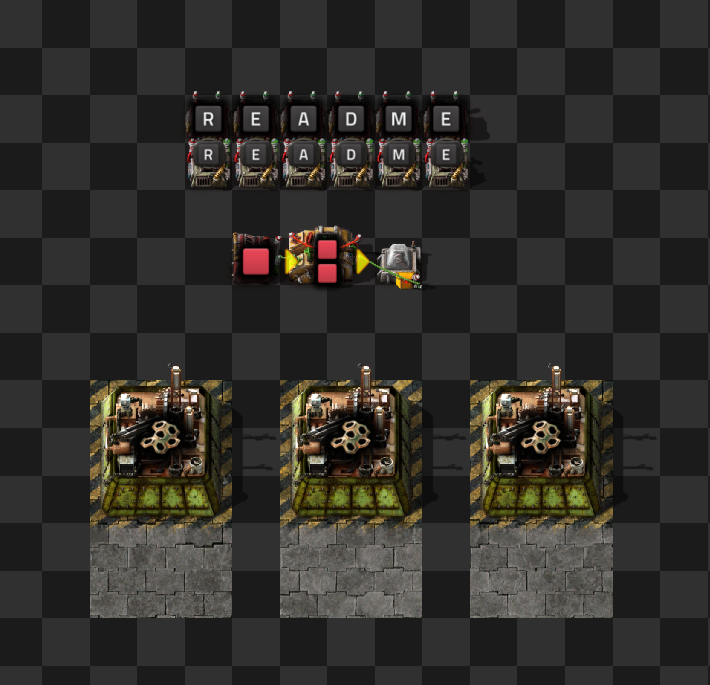

# factorio-draftsman


[](https://badge.fury.io/py/factorio-draftsman)
[](https://factorio-draftsman.readthedocs.io/en/latest/?badge=latest)
[](https://codecov.io/gh/redruin1/factorio-draftsman)
[](https://github.com/psf/black)
[](https://github.com/astral-sh/ruff)

`factorio-draftsman` is a Python module for creating and editing blueprints for the game [Factorio](https://factorio.com/).

```python
from draftsman.blueprintable import *
from draftsman.constants import Direction
from draftsman.entity import *

# Create new Blueprints from scratch
blueprint = Blueprint()
blueprint.label = "Example"
blueprint.description = "A blueprint for the readme."
blueprint.version = (2, 0)  # Factorio version 2.0

# Add new entities and configure them procedurally
test_string = "readme"
for i, char in enumerate(test_string):
    signal_string = "signal-{}".format(char.upper())

    constant_combinator = ConstantCombinator(tile_position=(i - 2, 0))
    section = constant_combinator.add_section()
    section.set_signal(
        index=0, 
        name=signal_string, 
        count=0,
    )
    blueprint.entities.append(constant_combinator)

    display_panel = DisplayPanel(tile_position=(i - 2, 1))
    display_panel.icon = signal_string
    display_panel.always_show_in_alt_mode = True
    blueprint.entities.append(display_panel)

# Flexible ways to specify entities
blueprint.entities.append(
    "constant-combinator",
    id="constant",
    tile_position=(-1, 3),
    direction=Direction.EAST
)
blueprint.entities.append(
    "decider-combinator",
    id="clock",
    tile_position=(0, 3),
    direction=Direction.EAST,
)    
blueprint.entities.append(
    "small-lamp", 
    id="blinker", 
    tile_position=(2, 3)
)

# Use IDs for ease of access on complex blueprints
constant: ConstantCombinator = blueprint.entities["constant"]
constant.add_section().set_signal(index=0, name="signal-red", count=1)

clock: DeciderCombinator = blueprint.entities["clock"]
clock.conditions = [
    DeciderCombinator.Condition(
        first_signal="signal-red",
        comparator="<=",
        constant=60
    )
]
clock.outputs = [
    DeciderCombinator.Output(
        signal="signal-red"
    )
]

blinker: Lamp = blueprint.entities["blinker"]
blinker.circuit_enabled = True
blinker.set_circuit_condition("signal-red", "=", 60)
blinker.use_colors = True

# Sophisticated relationship handling with Associations
blueprint.add_circuit_connection( # Constant to input of decider
    color="green", 
    entity_1="constant", 
    entity_2="clock"
)
blueprint.add_circuit_connection( # Input of decider to output of decider
    color="red", entity_1="clock", side_1="input", entity_2="clock", side_2="output"
)
blueprint.add_circuit_connection( # Output of decider to lamp
    color="green", entity_1="clock", side_1="output", entity_2="blinker", side_2="input"
)

# Import compressed blueprints
bp_string = """0eNqllGFrwyAQhv/LfdZhkmUl+SujDJNc2wO9FLVjXfC/z2TZBisrLH4S9d7n3pdDJ+jMBc+OOEA7AfUje2ifJ/B0ZG3mM9YWoQXtPdrOEB+l1f2JGGUFUQDxgG/QFnEvADlQIPwkLJvrC19shy4ViLskAefRJ/HIc88EVA+1gOuyxpkdyKzgX4WyWOpkEb87ODwk6iBP+l27QaZQvcOA0uAhJM83CJVNyPewxlC5KVRuCJWdIXsS2YPIn0N5S/iS/u37n6JNnVZ/1RZ/1RZ/d0XpYVJAm+5+/hEBr+j8gqmfyuaxaeqdKutdU8b4AbwVejE="""

# Group entities together and treat them all as one unit
group = Group.from_string(bp_string)
for i in range(3):
    blueprint.groups.append(group, position=(i * 4 - 3, 7))

# Quickly query Blueprints by region or contents
ccs = blueprint.find_entities_filtered(name="constant-combinator")
assert len(ccs) == len(test_string) + 1
asm_machines: list[AssemblingMachine] = blueprint.find_entities_filtered(type="assembling-machine")
assert len(asm_machines) == 3
for asm_machine in asm_machines:
    asm_machine.recipe = "low-density-structure"

# Every blueprintable type is supported
blueprint_book = BlueprintBook()
blueprint_book.blueprints = [blueprint, UpgradePlanner(), DeconstructionPlanner()]

print(blueprint_book.to_string(version=(2, 0)))  # Blueprint string to import into Factorio
```



# Overview

Simply put, Draftsman attempts to provide a universal solution to the task of creating and manipulating Factorio blueprint strings, which are compressed text strings used by players to share their constructions easily with others.
Draftsman allows users to programmatically create these strings via script, allowing for designs that would normally be too tedious to design by hand, such as combinator computer compilers, image-to-blueprint converters, pumpjack placers, as well as any other complex or repetitive design better suited for a computer's touch.

For a user-friendly timeline of how this project came about, as well as some pretty illustrations of it's capabilities, [you can read an article](https://alt-f4.blog/ALTF4-61/) written for the amazing fan-run community spotlight website [Alt-F4](https://alt-f4.blog/).

For more information on what exactly Draftsman is and does, as well as its intended purpose and philosophy, [you can read the documentation here](https://factorio-draftsman.readthedocs.io/en/latest/index.html).

For more examples on what exactly you can do with Draftsman, take a look at the [examples folder](https://github.com/redruin1/factorio-draftsman/tree/main/examples), which is organized into different categories for ease of navigation.

## Features
* Compatible with all versions of Python >= 3.7
* Compatible with the latest versions of Factorio (1.0.0+)
* Compatible with Factorio mods(!)
* Well documented
* Intuitive and flexible API
* Useful constructs for ease-of-use:
    * Give entities unique string IDs to make association between entities easier
    * Filter entities from blueprints by type, region and other parameters [just like Factorio's own API](https://lua-api.factorio.com/latest/LuaSurface.html#LuaSurface.find_entities_filtered)
    * Entities are categorized and organized within `draftsman.data` for easy and flexible iteration
    * Group entities together and manipulate them all as one unit
* Verbose Errors and Warnings (["Factorio-safety" and "Factorio-correctness"](TODO))
* Expansive and rigorous test suite

--------------------------------------------------------------------------------

# Usage

## Installation (For Users):

```
pip install factorio-draftsman
```

This will install the latest version of Draftsman with a copy of pre-generated data from [`factorio-data`](https://github.com/wube/factorio-data) (typically the latest stable version). Having a copy of the game (installed or at all) is not necessary to use Draftsman, but Draftsman can also use data from your user-specific installation.

If Factorio updates in-between Draftsman releases, or if you want to update your environment to support mods, then you can modify your Draftsman installation by running the companion command-line tool `draftsman`:

```
draftsman factorio-version latest
draftsman --mods-path "path/to/mods/folder" update
```

For more information on how to use this tool, you can run `draftsman -h` or see it's documentation [here](https://factorio-draftsman.readthedocs.io/en/latest/index.html).

## Installation (For Developers)

Clone the repository using your preferred method:

```
git clone https://github.com/wube/factorio-data.git
```

Install the package in editable mode:

```
pip install . -e
```

You 
```
python -m pytest test -Werror -vv
```

Note that testing currently is only *guaranteed* to work with a vanilla install.

### Coverage with [coverage](https://coverage.readthedocs.io/en/latest/):
```
coverage run
```

Code style/formatting is kept in check with `black` and `ruff`.

--------------------------------------------------------------------------------

## Contributing

Draftsman is a large and expansive project, intended to be used by as many people as possible. As such, it is a difficult project to maintain by myself. All support is welcome, whether it be finding/fixing bugs, improving mod compatibility, adding features, improving documentation, adding examples, or anything in-between. I maintain a [`TODO.md`](TODO.md) list which contains all the features that I'm currently planning on implementing (eventually, at least).

Bugs are tracked on the issue page; If you have an issue that's affecting you, search here for your issue and create a new one if it's not there.

If you have a feature request that is on the TODO list, or that you firmly believe belongs in Draftsman and you have a working prototype, then the issues page is also the place for that.

If you have a feature request that isn't currently on the TODO list and you believe it might be a good fit for the project, but you're not absolutely sure if it belongs or how it should be implemented into Draftsman, start a [discussion thread here](https://github.com/redruin1/factorio-draftsman/discussions/categories/ideas). If a discussed feature is accepted, it will get added to the TODO list and tracked on the issues page. 

If you want to contribute, read [CONTRIBUTING.md](CONTRIBUTING.md) first, fork the project, and dive in. When you're ready, submit a PR with the changes towards the intended branch, describing what exactly the changes intend to do (linking against any relevant issues if necessary). If all checks pass, you can expect the PR to merged in a (relatively) timely manner and pushed to the next minor or major version.

If Draftsman is useful to you or any of your projects (and you would like to grease it's continued development) then you can send me a dollar or two here:

<a href='https://ko-fi.com/L3L3XMUF' target='_blank'></a>