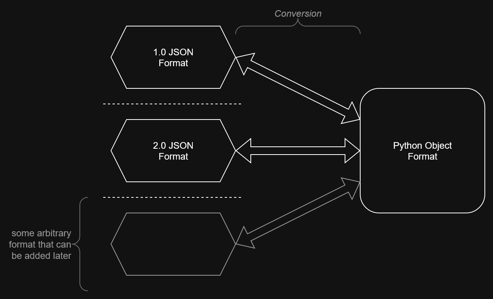

# 3.0 Release

Draftsman 3.0 is now released. Along with it come numerous improvements, fixes, and breaking changes that may affect your scripts.

## Blueprint Versioning

Draftsman 3.0 can now read/write different kinds of blueprint string JSON, corresponding to Factorio versions 1.X and 2.X:

```py
>>> import json
>>> from draftsman.entity import RocketSilo
>>> silo = RocketSilo()
>>> silo.request_modules("productivity-module-3", slots=(0, 1))
>>> print(json.dumps(silo.to_dict(version=(1, 0), exclude_defaults=False), indent=4))
{
    "name": "rocket-silo",
    "position": {
        "x": 4.5,
        "y": 4.5
    },
    "items": {
        "productivity-module-3": 2
    },
    "tags": {},
    "direction": 0,
    "recipe": "rocket-part",
    "connections": {},
    "auto_launch": false
}
>>> print(json.dumps(silo.to_dict(version=(2, 0), exclude_defaults=False), indent=4))
{
    "name": "rocket-silo",
    "position": {
        "x": 4.5,
        "y": 4.5
    },
    "mirror": false,
    "quality": "normal",
    "items": [
        {
            "id": {
                "name": "productivity-module-3",
                "quality": "normal"
            },
            "items": {
                "in_inventory": [
                    {
                        "inventory": 4,
                        "stack": 0,
                        "count": 1
                    },
                    {
                        "inventory": 4,
                        "stack": 1,
                        "count": 1
                    }
                ],
                "grid_count": 0
            }
        }
    ],
    "tags": {},
    "direction": 0,
    "recipe": "rocket-part",
    "recipe_quality": "normal",
    "control_behavior": {
        "read_items_mode": 1
    },
    "use_transitional_requests": false,
    "transitional_request_index": 0
}
```

Draftsman will automatically attempt to read the version of the blueprint from it's `version` key, and will default back to the Factorio version of the current environment if absent.

While a nice quality of life feature for interacting with different Factorio versions, an excellent side effect of this functionality is the logical separation between the serialized external format(s) and the internal Python format:



Because conversions between different formats are now guaranteed anyway, it permits the internal Python representation to severely diverge from the exported dictionaries - which means that they can be structured in ways that are more natural or convenient to use, or even in a manner that is more performant. For example, just because the serialized form has to be a `list`, doesn't mean that we couldn't use a `dict` for faster lookups on Draftsman's side during blueprint creation/manipulation. Converting from a `dict` to a `list` incurs some additional cost when creating the final blueprint string, sure - but this usually only ever happens once, while *manipulating* the blueprint prior can happen thousands, or even *millions* of times. Clearly, this will be an active source of potential optimizations once said optimization pass happens in the (hopefully) near future.

Due to this design pattern shift however, the syntax for importing has changed - made clearer and more intuitive, but changed nonetheless. Instead of using the constructor, you now use `from_string()` and `from_dict()` when importing from a external format:

```py
bp_string = "..."
blueprint = Blueprint.from_string(bp_string)

some_entitys_JSON_dict = {
    "name": "wooden-chest",
    ...
}
container = Container.from_dict(some_entitys_JSON_dict)
```

This now enlists a separate function for each distinct operation, rather than cramming importing and instance construction into the same syntactic spot:

```py
# If you want to import a Blueprint instance from external data, you use:
Blueprint.from_string(..., version=...)
Blueprint.from_dict(..., version=...)

# If you want to create a new instance of a Blueprint from scratch, you use the constructor:
Blueprint(
    label="blah",
    description="blah",
    ... # etc.
)

# If you want to export your Blueprint instance to external data, you use:
Blueprint.to_string(version=...)
Blueprint.to_dict(version=...)
```

For select circumstances, you may still be able to get away with the old `Entity(**json_dict)` syntax, but since the Python structure is now logically separated from the external forms this has no guarantee of continuing to work in the future.

## Using `attrs` instead of `pydantic`

Unsatisfied with `pydantic` as a validation solution, Draftsman 3.0 uses `attrs` and `cattrs`, a far simpler and sensical solution to handling the format conversions mentioned above. In addition, because everything is in readily apparent pure-python functions, altering the desired behavior is far more straightforward than the hackery needed to get Pydantic to behave. In addition, it's also likely that this switch introduced no performance regression, despite not having the Rust backend that Pydantic utilizes.

## Global Validation

Before, validation of certain Draftsman objects could be enabled/disabled via a pair of arguments passed to it's constructor:

```py
blueprint = Blueprint(validate="none", validate_assignment="strict")
assert blueprint.validate_assignment == ValiationMode.STRICT
```

Already this is confusing - what is the difference between `validate` and `validate_assignment`? Why are they both provided to the constructor, but only `validate_assignment` is available after construction? When does the conversion from a string literal to a `ValidationMode` take place?

And that is just considering the specification of the behavior - now consider the question of whether validation should recurse through a Draftsman object's children:

```py
blueprint = Blueprint(validate_assignment=ValidationMode.STRICT)
blueprint.entities.append("new-entity", ...)

blueprint.validate() # Should this validate "new-entity" or not?
```

You can "cheat" and give each component their own validation 'flag', but then you now have to resolve between them:

```py
blueprint = Blueprint(validate_assignment = "none")
blueprint.entities.validate_assignment = "strict"
entity = new_entity("new-entity", validate_assignment = "none")

blueprint.entities.append(new_entity) # Which `validate_assignment` should be used?
```

After many conceptual headaches, I came to the conclusion that the only reasonable solution was to massively reduce complexity. No longer is validation specific to certain Draftsman objects - now, it is a single global flag which affects all Draftsman behavior:

```py
from draftsman import validators

validators.set_mode(ValidationMode.DISABLED)
# No errors or warnings will be issued by Draftsman

validators.set_mode(ValidationMode.PEDANTIC)
# Draftsman's validators will be maximally enabled, beyond default behavior

validators.set_mode(ValidationMode.STRICT)
# Draftsman's default behavior
```

This is far simpler and easier to intuit, while largely retaining almost all of the flexibility of the old system. You can use `validators.get_mode()` to query the current validation value, and `set_mode()` can be used as a context manager to temporarily change the validation mode for a specific code block:

```py
# Turn off validation
draftsman.validators.set_mode(ValidationMode.DISABLED):
assert draftsman.validators.get_mode() is ValidationMode.DISABLED

with draftsman.validators.set_mode(ValidationMode.PEDANTIC):
    # Inside of this block, the validation will be maximally enabled
    assert draftsman.validators.get_mode() is ValidationMode.PEDANTIC

# Now that we're out of the context manager block, we return to `DISABLED`
assert draftsman.validators.get_mode() is ValidationMode.DISABLED
```

If more flexibility is needed, expanding this system will be far easier than fixing the old one.

## Removed `__factorio_version__` and `__factorio_version_info__`

Instead, users should use `draftsman.data.mods.versions["base"]`, which is guaranteed to update when the environment updates during script execution. If this value is not present due to a missing or corrupted environment, users can fallback to `draftsman.DEFAULT_FACTORIO_VERSION`.

## `tiles` is now added to `Group`

Users can now add tiles to Groups in the same way as entities, which are ultimately flattened to a 1-dimensional structure when exporting. In order to resolve this change, the `entities` array is no longer the place to store `Group` instances - instead, users should use the `groups` attribute:

```py
group = Group()
group.entities.append("wooden-chest")
group.tiles.append("refined-concrete")

blueprint = Blueprint()
for i in range(3):
    blueprint.groups.append(group, position=(i, 0))

print(blueprint.to_string())
```


This makes the tree structure more explicit, and prevents users from having to access nested tiles like `blueprint.entities[...].tiles[...]`, which would be rather confusing.

However, while the nested accessing is gone from `EntityList`, you can still use tuples of `int`/`str` to represent entity "paths" for things like `add_circuit_connection()` and similar:

```py
# This stuff still works:
blueprint.add_circuit_connection("red", ("group1", "entityA"), ("group2", "entityB"))
```

## Additional Minor Features/Fixes

* Should now be fully compatible with Factorio 2.0's prototypes and attributes, since all differences had to be categorized in order for the versioned importing/exporting.
* Documentation is now (finally) up-to-date, if not 100% complete in all cases.
* Added the `InventoryType` enumeration for specifying item requests to specific inventory spots.
* Cleaned up the build system, so hopefully contributions can be made more easily - updated the README with more information.