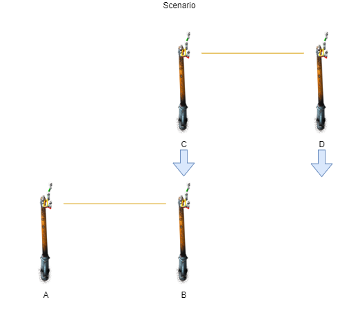
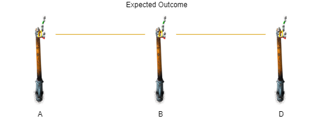
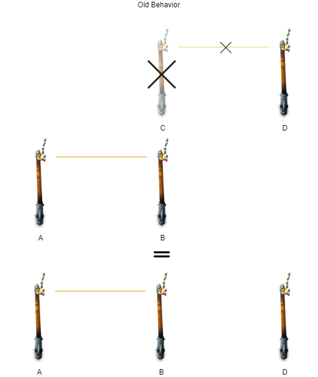
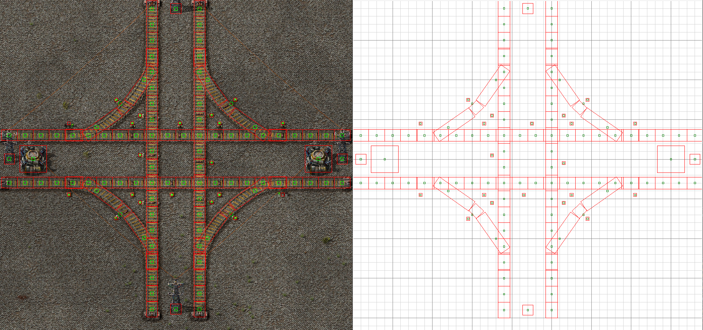

# 1.0 Release: Changes and Notes

This release is particularly big and complex, and it also introduces a few breaking changes, which I have avoided up to this point. Instead of just dumping a fat changelog list, I figured writing out the biggest changes in a more digestible way will be desirable for the people that actually use my module.

--------------------------------------------------------------------------------

## Entity Merging (finally)

The biggest feature added to `1.0.0` is *entity merging*, or the ability to take two similar entities at the same position and combine them into one. Consider an electric network as an example:



if you have a blueprint that is a grid of power poles, you would expect that if you placed power poles such that the edges of each grid overlapped, the power poles at the edge would join the wire connections of the two blueprints together:



However, prior to `1.0.0` this behavior was not built into Draftsman; placing two power poles on top of each other would result in two power poles, on top of each other. When imported, both poles would exist in the blueprint, but only one (the first one added) would be placed first, and the second one (with no valid spot to occupy) would get ignored; along with any connections it may have had. 



Now, if you specify `merge=True` when adding an entity with `EntityList.insert()` or `EntityList.append()` (or a Tile with `TileList.insert()`), the entity that currently exists within the Blueprint/Group will have it's attributes updated and the entity being added will be deleted, following what you would expect from Factorio. However, there are some restrictions with entity merging that might differ from some behavior in Factorio, and I'll distinguish between what I've termed "merging" and "replacing" entities; *merging* in Draftsman is allowed, but *replacing* is not. 

The main distinction between merging and replacing is that merging is only permitted between entities with the *exact same name and type*; you can merge two `"small-electric-pole"` entities together, but you can *NOT* merge a `"small-electric-pole"` with a `"medium-electric-pole"`, even though they have the same type and are the same size. The former is merging, the latter is replacing. The reason *replacing* is forbidden is the same reason that you cannot change the name of an entity after it's created; there's no guarantee that the new entity you're changing it to has the same attributes that the previous one did. Inventory bars, valid recipes, item requests, and many others are not guaranteed even on a per class type basis, so you potentially have to write a conversion from every entity instance to every other entity instance, which is tedious to write and hard to maintain. It is much safer to restrict their names so that any and all attributes must belong to both.

*Replacing* also opens the door up to much more type-specific behavior; Should belts with different directions be able to placed on top of other belts, like how manual placement works? What about placing belts on top of other belts that face the same direction, but are of a different type? Should an entity with no control behavior placed overtop an entity with control behavior set the control behavior to `None`, or should it inherit from the original entity? All of these are highly specific to their particular circumstance, and there is no clear "best" manner of operation; the user might want to prefer one way in one circumstance, and another way in another circumstance.

So, "replacing" is off the table, at least for this version. This leaves merging, which is more easily defined and implemented. In order for an `Entity` to be merged, it must:

1. Be an instance of the same class (`Container`, `TransportBelt`, `ElectricPole`, etc.)
2. Have the exact same `name`
3. Have the same `id` (can be `None`, but both must be `None`)
4. Occupy the exact same `global_position`
5. Be facing the exact same direction (if applicable)

These criteria are represented under the member function `Entity.mergable_with()`, which is implemented for every `Entity` in Draftsman. This way you can simply check if two entities are considered mergeable by writing `entity_a.mergable_with(entity_b)`:

```python
from draftsman.entity import ElectricPole

entity_a = ElectricPole("small-electric-pole", tile_position=(0, 0))
entity_b = ElectricPole("small-electric-pole", tile_position=(0, 0))

print(entity_a.mergable_with(entity_b)) # True

entity_b.tile_position = (1, 1)

print(entity_a.mergable_with(entity_b)) # False

entity_c = ElectricPole("medium-electric-pole", tile_position=(0, 0))

print(entity_a.mergable_with(entity_c)) # False
```

Since we know definitionally entities are going to be of the exact same type, we no longer have to worry about attribute mismatch, though exactly what an entity inherits is particular to what kind of entity it is. All relevant metadata is overwritten by the entity placed on top of it, regardless of content; which also includes overwriting the existing data with nothing. There are two exceptions to this rule, `"connections"` (wire connections) and `"neighbours"` (power connections), which are unions of the two entities.

Merging is most typically used when adding/inserting `EntityLikes` into an `EntityList`:

```python
example_entity = Container("steel-chest")

blueprint = Blueprint()
blueprint.entities.append(example_entity)
example_entity.bar = 10
blueprint.entities.append(example_entity, merge=True)

print(len(blueprint.entities)) # 1
print(blueprint.entities[0].bar) # 10
```

Care should be taken with merging with Groups, as currently the merging algorithm does not delete empty groups. For example, if you place two groups exactly on top of each other (probably by accident), then you end up with only one set of entities, and two groups total, one with no entities:

```python
group = Group()
group.entities.append("transport-belt")

blueprint = Blueprint()
blueprint.entities.append(group)
blueprint.entities.append(group, merge=True)

assert len(blueprint.entities) == 2                 # Two Groups
assert isinstance(blueprint.entities[0], Group)
assert len(blueprint.entities[0].entities) == 1     # 1 TransportBelt
assert isinstance(blueprint.entities[1], Group)
assert len(blueprint.entities[1].entities) == 0     # No entities(!)
```

This is done to ensure that Draftsman does not delete any more entities than is absolutely necessary, and to preserve groups so that a user can guarantee that a Group itself will still exist after it is inserted into another `EntityCollection`, even if all of it's sub entities get merged. If you want to prune these empty Groups, they can be done explicitly by the end user.

If two entities overlap their positions but cannot be merged (or if `merge=False`), `EntityList.append()/insert()` will insert both entities into the list and raise `OverlappingObjectsWarning`, just as before. Thus, only entities that meet the criteria for `mergable_with` will ever get merged in Draftsman functions. However, there's no reason you can't bypass this check and just call `entity.merge(other_entity)` directly:

```python
yellow_belt = TransportBelt("transport-belt", tile_position=(0, 0), direction=Direction.NORTH)

red_belt = TransportBelt("fast-transport-belt", tile_position=(10, 10), direction=Direction.SOUTH)
red_belt.set_logistic_condition("signal-A", ">", 1000)

yellow_belt.merge(red_belt)

print(yellow_belt.name)      # "transport-belt"
print(yellow_belt.position)  # (0.5, 0.5)
print(yellow_belt.direction) # Direction.NORTH
print(yellow_belt.control_behavior["logistic_condition"])
# {'comparator': '>', 'constant': 1000, 'first_signal': {'name': 'signal-A', 'type': 'virtual'}}
```

As far as whether or not you *should* be able to call `entity.merge(other_entity)` without ensuring that `entity.mergable_with(other_entity)` is true, I haven't come to a conclusion on. On one hand, it makes sense to not allow a user to use the merging function without ensuring all the safety checks. However, separating the two allows the user to perform merges between entities that would be otherwise valid, allowing the user to bridge the gap into replacing. For example, merging a small-electric-pole with a medium-electric-pole in practice creates no issues; doing so would simply combine their connections while preserving the type of entity that was placed first. Rather, it's that general mergers of this sort cannot be *guaranteed* to cause no issues, so they are disallowed under the criteria specified in `mergable_with()`.

I think for now I'll keep the two distinct in the off case where users might want to quickly copy entity specific behavior from one entity to another, though a more dedicated solution should probably be investigated, either on the user's end or as another feature request for Draftsman. However, if entity replacing does eventually get added to Draftsman, said revision will probably unify the `merge()` and `mergable_with()` functions together and disallow merging unless `mergable_with()` returns true. Feel free to leave a comment below on your thoughts on whether or not you'd like to see entity replacing supported by Draftsman.

--------------------------------------------------------------------------------

## Breaking changes with the introduction of `Vector`

In addition to entity merging, version `1.0.0` introduces a number of (potentially) breaking changes. However, these changes are (thankfully) few and far between, and all are done with deliberate reason:
* `position`, `tile_position`, and `global_position` in entity-likes and tiles are now instances of `Vector`, which are positions that can be accessed naturally with `x` and `y` attribute and support vector operations with scalars as well as other vectors.
* The following function signatures have been updated to use `Vector`s instead:
  * `EntityCollection.find_entity()`
  * `EntityCollection.find_entity_at_position()`
  * `EntityCollection.find_entities()`
  * `TileCollection.find_tile()`

These changes are primarily to make interfacing with spatial queries easier:

```python
from draftsman.blueprintable import Blueprint
from draftsman.entity import Container
from draftsman.classes.vector import Vector

blueprint = Blueprint(...)
found_inserters = blueprint.find_entities_filtered(type="inserter")

chunk_location = Vector(1, 1)

for inserter in found_inserter
    # Check to the right of the inserter
    entity = blueprint.find_entity_at_position(inserter.position + (1, 0))
    if entity is None:
        continue

    print(entity.position) # (x, y)

    if entity.type == "container":
        # Offset new position by chunk_location * 32 tiles
        target_position = inserter.tile_position + chunk_location * 32
        # Add a (potentially) upgraded copy at the target location
        blueprint.entities.append("steel-chest", tile_position=target_position)

    # ...

```

As you can see, the ability to add vectors with tuples and lists makes interfacing with Draftsman much more natural, and being able to access a `Vector`'s attributes by `.x` and `.y` is a plain upgrade over `["x"]` and `["y"]`. In an effort to remain compatible though, `Vector`s also allow accessing their components via array indices `[0]` and `[1]`, and the old dictionary keys `["x"]` and `["y"]` (which makes using them interchangeably with tuples and other structures nice and easy). However, this means that if you wrote code that directly copies the contents of `Entity.position` or similar attributes expecting a `dict`, this is no longer the case:

```python
surely_this_is_a_dict = entity.position # Not anymore
```

Fortunately, if this is desired you can now use the member function `to_dict()` like other Draftsman constructs:

```python
definitely_a_dict = entity.position.to_dict()
```

`Vector` now also has a static method `from_other()` which allows you to convert a primitive type (such as a `list`, `dict`, or `tuple`) into a `Vector` instance, if you want to unify some input:

```python
# The second argument is the data type to cast to on creation, which defaults to `float`
print(Vector.from_other((10, 10))) # (10.0, 10.0)
print(Vector.from_other([1.4, 2.3], int)) # (1, 2)
print(Vector.from_other({"x": 23.0, "y": 1}, float)) # (23.0, 1.0)
```

Originally I implemented `Vector` throughout the entire API, replacing the contents of all the utility functions as well as the member functions of `SpatialHashMap`. However, after some testing I realized this was *much* slower, anywhere between 5-10 times as slow. To combat this, only "forward-facing" API functions use `Vector` for user friendly-ness; everything else uses `PrimitiveVector`, which is simply a list of the format `[float, float]`, which is much more performant.

--------------------------------------------------------------------------------

## `collision_box` is no more: `CollisionSet` takes it's place

For 99% of all entities in Factorio, each entity has a axis-aligned box that is used to check for collisions. Prior to `1.0.0`, this was the only collision object used to determine if two entities were overlapping. Annoyingly for me however, not all Factorio entities are axis aligned, and some still actually have multiple collision boxes; leading to strange and unexpected behavior (especially when the game itself happens to give dummy `collision_box` data).

Now, `collision_box` has been replaced with `collision_set`, an instance of `CollisionSet` which provides these missing features. `CollisionSet`s have a list of `shapes` of which their union is tested when checking for intersection, and with the addition of `utils.Rectangle` we now also have proper non-axis aligned collision checking. This should lead to a much better indication when entities are *actually* overlapping, particularly with rails and their signals. In addition, rail overlapping has been corrected so that rails only issue `OverlappingObjectsWarning` when they are identical (same name, direction, and occupy the same spot), bringing behavior in line with the game. These two changes now make it so you shouldn't have to immediately disable the warning whenever working with rails just to keep your sanity.

By abstracting collisions into `CollisionSet`, this also makes custom collisions for custom `EntityLikes` much easier as well. If you want to add a circle collision shape, simply create a new child class of `utils.Shape`, implement the relevant functions, and add it to your `EntityLike`'s `collision_set`, and it should all just work™.

I also ended up making a simple tool to display a graphical representation of the collision boxes using python TKinter, which was very useful in debugging issues with the new collision objects, as well as ensuring accuracy:


<figcaption align = "center"><b>Collision boxes are in red, and entity positions are the centers of the green boxes.</b></figcaption>

You can find the implementation this tool in the `/test/tools/view_collisions.py` file in Draftsman's source code.

--------------------------------------------------------------------------------

## Abstraction of `SpatialHashMap` into `SpatialDataStructure`

Continuing along with the theme of improved abstraction and better performance, the abstract `SpatialDataStructure` was created, of which `SpatialHashMap` is now a child. This will make it possible in the future to experiment with different types of Spatial organization (quadtrees or other) which may (or may not) be more performant than the current hash-map implementation. Doing this will also make it possible in the future for the end user to pick which implementation they might want, if one will be faster for their particular use-case.

Note however that these different implementations will not be part of `1.0.0`; only the framework is being changed. All instances of `Blueprint` and `Group` will still use `SpatialHashMap`, until I can get some concrete data on alternatives.

--------------------------------------------------------------------------------

## Performance tests added to the testing suite

Now that the module is maturing, I started to turn my attention to improving the performance of some of the most costly functions and methods of Draftsman. Draftsman was never designed to be very fast, and it still isn't; user friendliness and output safety were and still are the core philosophy behind this project. Due to the number of checks and the complexity of the validation that Draftsman makes, it is never realistically going to be faster than a specific, optimized implementation, making Draftsman's purpose more as a prototyping tool than as final-implementation software.

However, just because it's not *designed* to be fast doesn't mean it *has* to be slow. As mentioned before, the switch to using `Vector`s everywhere would have created a significant performance impact for minimal gain, so only the front-most interface uses them. Another big optimization was splitting `signatures.CONTROL_BEHAVIOR` into many sub-schemas, one for each unique entity type. This has the double-benefit of being faster while also being more in line with Factorio-safety, preventing the user from adding useless control behavior keys into entities that don't use them.

After fixing these two most blaring issues, come down to a series of more structural issues, that will probably be much harder to optimize away. The most expensive operations seem to be the ones involving copying or adding entities to other structures (predictable) and data validation using schema (also somewhat predictable), and below that even a number of inbuilt functions that I use commonly throughout the module (such as `getattr` and `isinstance`, which is probably less than ideal to use in "production" code).

At this point, I'm going to be conservative with my optimizations, as I think handling the ones listed above will require some serious investigation to gain any real tangible performance impact while maintaining functionality. However, [as has already come up](https://github.com/redruin1/factorio-draftsman/issues/28) there are a number of operations that "should" be faster than they are, so I'm willing to make concessions in particular circumstances. An alternative would also be documenting faster ways to perform certain frequently-used operations, which I address somewhat in that issue.

--------------------------------------------------------------------------------

## Conclusion

Those are the most important/impressive changes, but there have been many minute changes as well; formatting of the codebase, revised documentation to now work with doctests (so that they are actually guaranteed to match the module, which has already become problem in the past), and many other smaller changes have made it into this release. A big thanks goes out to all the people actually using my module, and the ones issuing bug reports and feature requests to make it better than what I had ever planned. Hopefully this version will be more stable and useful than ever before, so you can keep growing that factory.