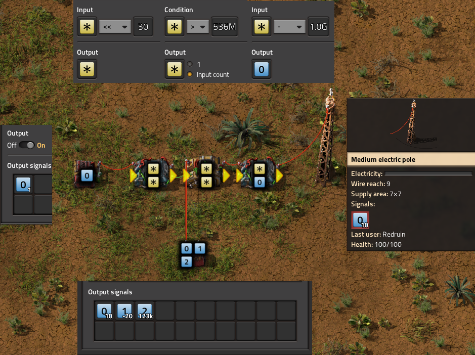
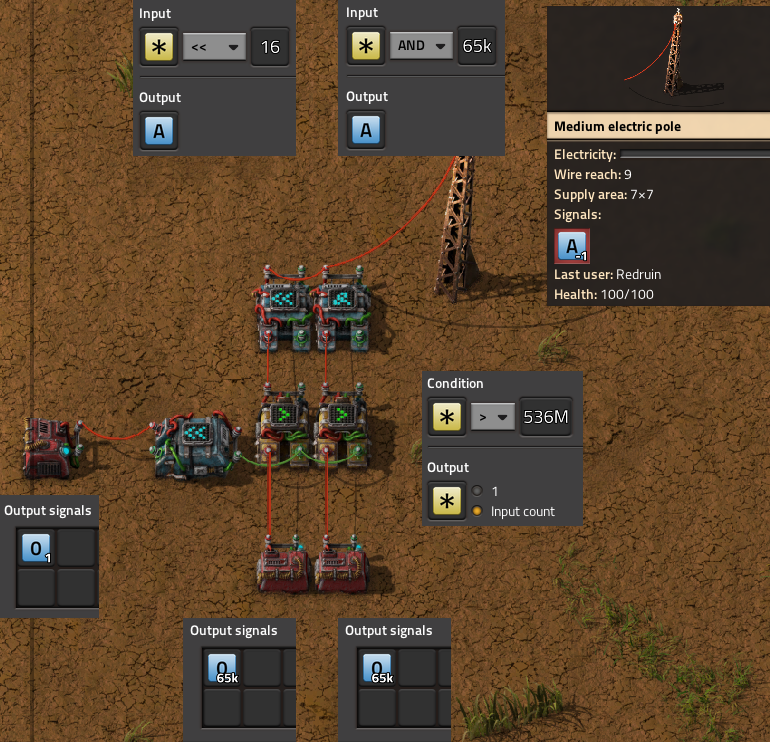
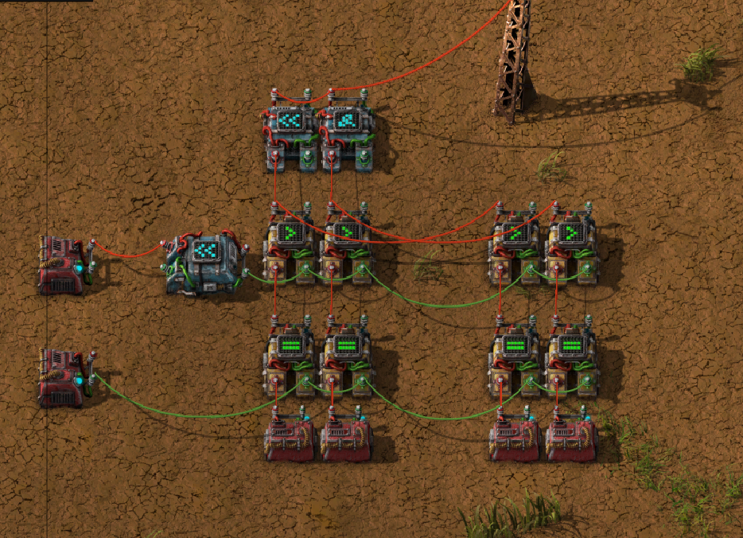
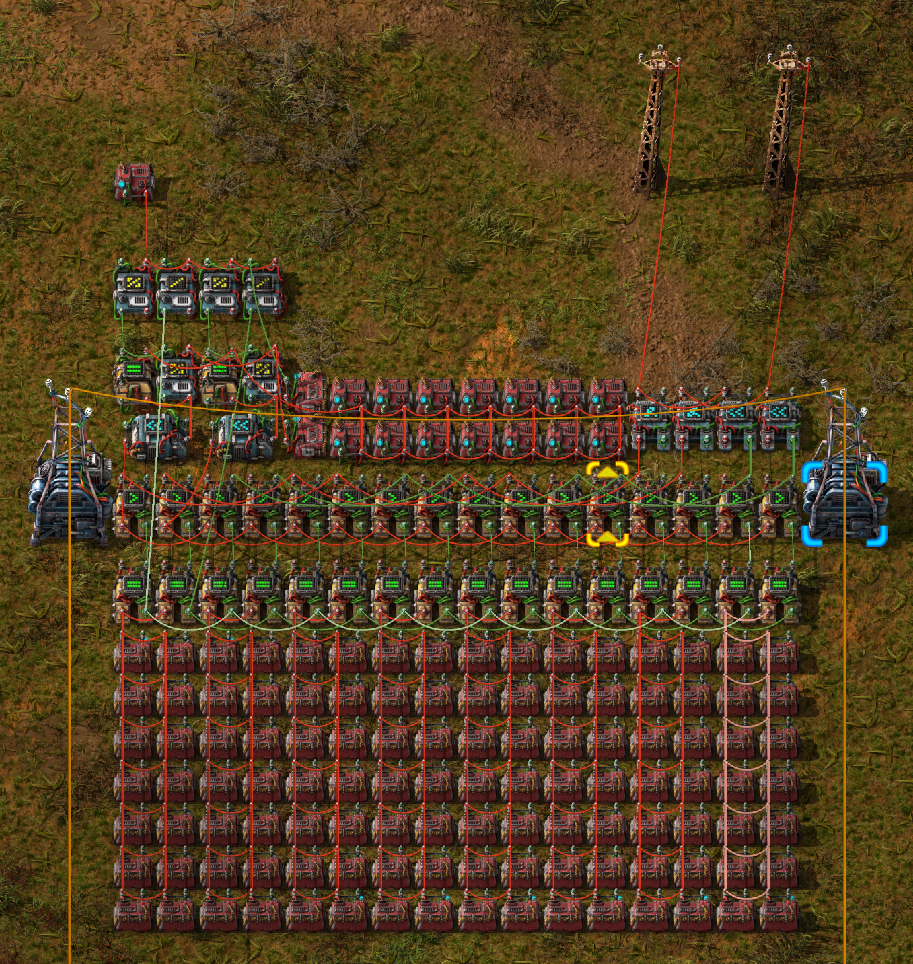
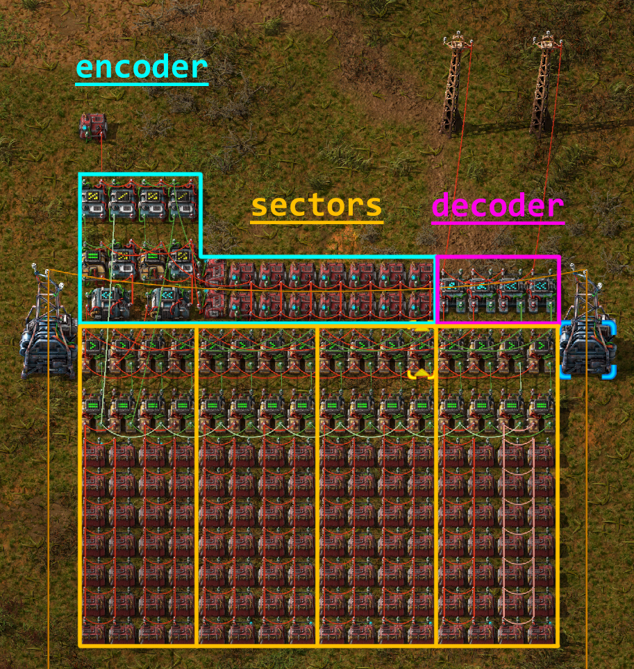
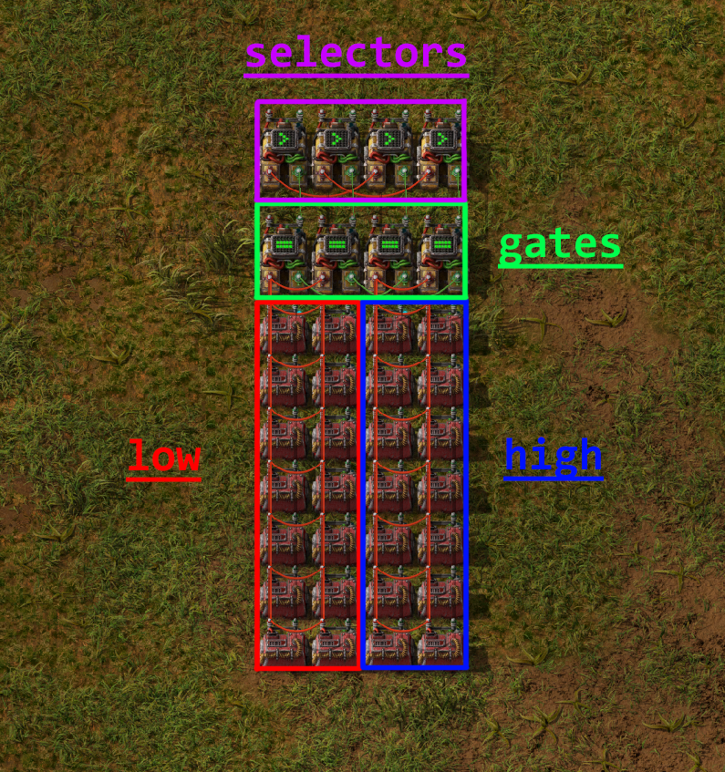

Groups
======

Overview
--------

:py:class:`.Group` classes in Draftsman are one of it's most powerful features.
Groups allow you to create "sub-blueprints" that can be placed inside a blueprint multiple times, or even inside other Group objects.
This allows the user to fragment blueprints into unique, discrete components that can be specified once and then reused multiple times, reducing repetitive code and improving readability.
The ability to use Groups was one of the core design pillars of Draftsman when it was originally made, and was present in the very first prototypes of the module.

To illustrate how to use Groups and in what ways they are useful, I'll use the problem that originally sparked the construction of the entire module in the first place; a design for a combinator computer 32-bit Read-only Memory.
This problem is already solved with an implementation in the `examples folder here <https://github.com/redruin1/factorio-draftsman/blob/main/examples/1KiB_sector_ROM.py>`_ , if you want to take a look at just the raw implementation.
The rest of this page will be an outline of the problem and a walkthrough of the source, piece-by-piece.

Outline of the problem
----------------------

I wanted a compact signal storage medium for a revision of my combinator computer.
I had 3 primary restrictions:

    1. I wanted the output signals from the ROM to be true 32-bit numbers.
    2. I wanted to be able to query from 2 places in the ROM simultaneously.
    3. I wanted the data storage to be as spatially compact as possible.

The most compact way to store data in constant combinators to fill every slot with a different signal type and a signal filter apparatus to only pass through the signal or signals that you want.
The trouble with this is that if you want the filtering process to be fast, the most reliable and simple way to achieve this is to reserve a bit in the number to act as a filter flag, and only output the signals that have that bit set:

.. code-block:: text

    |v-- ---- ---- ---- ---- ---- ---- ----
    0100 0000 0000 0000 0000 0000 0000 0000

    '|' = sign bit
    'v' = filter bit
    '-' = data bit
    ' ' = unused

The following example actually requires 2 bits to operate, as a limitation of the decider combinator not being able to check a single bit.

This is fast and works, though it violates the primary restriction; *true* 32-bit numbers.
No matter which way you work around it, in order to have 32 data bits and at least 1 bit flag to determine which signal to output, you need at minimum 33 bits per data signal, which butts against the limitation of signals in Factorio being only 32-bits in size.

Well, if you can't fit 33 bits in one signal, you can certainly fit them in *2* signals.
A solution to this is to simply split the data signal into 2 parts, store them internally as those 2 parts, and then recombine them on output.
For simplicities sake, I split the data into the lower 16 bits and the higher 16 bits, which are known as **low** and **high**, respectively:

.. code-block:: text

    Low bits:
    |v                  ---- ---- ---- ----
    0100 0000 0000 0000 1111 1111 1111 1111

    High bits:
    |v                  ---- ---- ---- ----
    0100 0000 0000 0000 1111 1111 1111 1111

    '|' = sign bit
    'v' = filter bit
    '-' = data bit
    ' ' = unused

Recombination is simple; The low bits pass through a simple AND of the lower 16 bits of the number to get rid of the filter bit, and the high bits are left shifted 16 spots, also removing the filter bit. The two numbers can be added together on a single wire, since none of their bits overlap, meaning the recombination only has a delay of 1 tick.

In order to read from two places at once, I doubled the above logic to take two address signals, labeled as **A** and **B**.
In addition, we also need to link sectors in parallel, which means that we need to determine which cluster of combinators to read from, and how to differentiate between each set.
To do this, we introduces another signal to specify which sector to read from:

Add some more combinators for a max of 256 signals for each "sector", and some logic for converting a numeric address signal to a signal type and sector number, and you get the final working design:

This works well, and is *very* dense; A row of 4 sectors can hold literal kilobytes of data, 4 KiB per row, all in a data space of only 16 x 11 tiles.
If you only need 30-bits per number this density could probably almost be doubled, assuming you can figure out the proper interface for it.

However, this manner of storing data is difficult to populate by hand, to say the least. Manually ANDing and shifting a number in a calculator, plus the manner of placing 2 separate signals, while ensuring that they must have the same type in 2 different places with 2 different values, made the design unviable to use by hand despite it's benefits.
Of course, this process would be *very simple* if I could just get a computer to do it for me... Hence, Draftsman.

Structure of the Solution
-------------------------

The basic design can be broken up into a set of unique parts, each one performing a specific function:

    1. An **encoder**, or a circuit to take the address line of the ROM to read and send the appropriate signals to the sectors;
    2. One or more **sectors**, which are where the actual data is stored, which output the high and low bit values across separate output lines, for both address *A* and address *B*;
    3. And a **decoder**, which takes the 4 *high* and *low* output lines, 2 for *A* and 2 for *B*, and recombines them to 2 constant signals each with the correct 32-bit value.

Further, an individual **sector** can be discretized into multiple parts of its own:

    1. The "cell" of constant combinators holding the **low** bits;
    2. The "cell" of constant combinators holding the **high** bits;
    3. **Gate** combinators that determine whether or not to output the data from this **sector**;
    4. And **Selector** combinators that filter the contents from the **gates** and output only the types of signal filtered by the **encoder**.

Hopefully you can start to see the naturalness of specifying each component as a Group object; Only the position and the data stored changes between each sector.
It makes sense that we should be able to construct a single sector, connections and all, and then simply copy-paste the object, only changing a few attributes each time.
Groups will allow us to do exactly this.

Implementation Overview
-----------------------

The first thing we do to aid in clarity is to create a custom :py:class:`.EntityLike` that is a child of :py:class:`.Group`, called ``CombinatorCell``. 
The description provided is fairly self-explanatory:

.. code-block:: python

    class CombinatorCell(Group):
        """
        Regular grid of constant combinators populated with data and linked
        together. Allows the user to set their data in bulk, acting like a single
        combined constant combinator.
        """
        # ...

In our way of looking at the problem, each individual constant combinator is irrelevant; in actuality they act as one big one that has all the signals we need, one for the set of low signals and one for the set of high signals.
Since we treat them as one singular entity, it makes sense to group them all together and treat it as a single object that has a single position and a single set of data.
``CombinatorCell`` only has 2 methods, an ``__init__`` function and ``set_data``, which sets the contents of the cell's combinators.
The first half of ``__init__`` is fairly straightforward:

.. code-block:: python

    def __init__(
        self,
        id,
        name="combinator-cell",
        position=(0, 0),
        dimension=(1, 1),
        wire_color="red",
        **kwargs
    ):
        # Initialize parent (Group)
        super(CombinatorCell, self).__init__(id, position=position)

        # ID of the cell. Required
        self.id = id

        # Name of the entity. Can be used if you want to specify different types
        # of CombinatorCell with the same class.
        self.name = name
        # Type of the entity. Here we set it to constant-combinator, so that any
        # queries on the blueprint for constant-combinators will also return
        # these objects.
        self._type = "constant-combinator"
        # Name of the constant combinator. Can be substitued with a modded one,
        # but the design would have to change if it was a different dimension.
        combinator_name = "constant-combinator"
        # position (will be the top left corner)
        self.position = position
        # width and height of the grid, from top left to bottom right
        # self._tile_width, self._tile_height = dimension

        self.direction = Direction.NORTH  # Default
        if "direction" in kwargs:  # Optional
            self.direction = kwargs["direction"]

        comb = ConstantCombinator(combinator_name, direction=self.direction)

        # Match the collision mask with the sub-entities
        self._collision_mask = comb.collision_mask

        # number of signal slots per combinator
        self.item_slot_count = comb.item_slot_count

        # ...

Here, we set up a selection of metadata about the object.
The ``id`` attribute is important, as it will be one of the keys to access the constant combinators associated with the entity.
We also create a local constant combinator instance ``comb`` specified using the ``combinator_name``, which allows us to specify a different constant combinator, if one was available. 
We also keep track of ``item_slot_count``, which we'll need for ``set_data`` later.

The second half of ``__init__`` creates a grid of combinators specified by ``dimension``, from top-left to bottom-right in rows:

.. code-block:: python

        # ...

        # Keep a list of combinators in the grid
        for j in range(dimension[1]):
            for i in range(dimension[0]):
                comb.tile_position = ((i * comb.tile_width), (j * comb.tile_height))
                comb.id = str(i) + "_" + str(j)
                self.entities.append(comb)

        # Connect all the combinators to each other
        for j in range(dimension[1]):
            for i in range(dimension[0]):
                current = self.entities[str(i) + "_" + str(j)]
                try:
                    across = self.entities[str(i + 1) + "_" + str(j)]
                    self.add_circuit_connection(wire_color, current.id, across.id)
                except KeyError:
                    pass
                try:
                    below = self.entities[str(i) + "_" + str(j + 1)]
                    self.add_circuit_connection(wire_color, current.id, below.id)
                except KeyError:
                    pass

Each ID of the combinators is set to it's position in the grid, as a string of the format ``"x_y"``, starting at 0.
This means that the top left combinator of the cell would have the ID ``"0_0"`` and would be accessed as such.
Each entity is added to the ``entities`` list (which is inherited by ``Group``) and is connected in a regular grid to it's neighbours, cementing them together in the same signal network.

The only other function we need is ``set_data``:

.. code-block:: python

    def set_data(self, mapping, data):
        """
        Sets the data in the cell. Starts in the top-right combinator, then goes
        across and down, filling each combinator's entry with the signal
        specified by `mapping` and the value specified by `data`.
        """
        assert len(data) <= len(mapping)
        assert len(data) <= self.item_slot_count * self.tile_width * self.tile_height

        for combinator in self.entities:
            combinator.set_signals(None)

        for i, value in enumerate(data):
            current_combinator = self.entities[int(i / self.item_slot_count)]
            # Only set the signal if it's nonzero to save space
            if value:
                current_combinator.set_signal(
                    i % self.item_slot_count, mapping[i], value
                )

``mapping`` is a list of signal names, which correspond to each unique signal that we need to encode the data, while ``data`` is the actual values of each signal to set.
Assertions are made to ensure that we don't have more data than we have unique signals, and that the total number of combinators in this grid can actually hold the number of signals that we set.
Then the signal contents of all the combinators are wiped and then set with the signal names and values sequentially starting with the top-leftmost combinator.
Because signals that have a value of zero are still inserted into the combinator (which makes the output blueprint more complex), in order to reduce bloating of the final blueprint string we only set signals that are non-zero.

We can now use this class to create a rectangular grid of constant combinators of any size, filled with any data. 
Useful, particularly if one might need to create other ROM designs in the future.
Let's use this to create the final blueprint.

Before we can start placing entities, we need to create that signal ``mapping`` list mentioned before.
This is fairly straightforward; the following is specified in the ``main()`` function:

.. code-block:: python

    # Specify the interface signals:
    address_signal = "red-wire"
    sector_index_signal = "green-wire"

    # Blacklist desired signals:
    blacklist = []
    # There are 262 valid vanilla signals in the game
    # We can't use the special signals in constant combinators
    blacklist += ["signal-anything", "signal-everything", "signal-each"]
    # And the interface signals have to be different by nature of this blueprint
    blacklist += [address_signal, sector_index_signal]
    # Which leaves us with 1 spare signal that we can choose to avoid
    # (unless you're using mods)
    blacklist += ["signal-info"]

    # Generate the signal mapping set
    mapping = []

    def add_signals_to_mapping(signals):
        for signal in signals:
            if signal not in blacklist:
                mapping.append(signal)

    add_signals_to_mapping(signals.virtual)
    add_signals_to_mapping(signals.item)
    add_signals_to_mapping(signals.fluid)

    assert len(mapping) >= 256

We first construct a blacklist of signals that we either cannot use (the pure-virtual signals), are already used by the blueprint (``address_signal`` or ``sector_index_signal``), or do not want to use (such as ``"signal-info"``, because I use it frequently in other circuitry). 
We then iterate over all signals, adding them in order to the ``mapping`` list if they're not a member of the blacklist.

Now that we have the mapping of signals, we can actually start creating a sector object:

.. code-block:: python

    # Sectors are akin to Hard-drive sectors and are where the data is stored
    sector = Group(id="sector_0")

    # Each sector has 4 gates and 4 selectors, 2 for low & high and 2 for A & B
    # Selectors select which the correct signal from the 256 signals from the
    # sector
    selector = DeciderCombinator("decider-combinator")
    selector.set_decider_conditions("signal-each", ">", 2**29, "signal-each")
    selector.copy_count_from_input = True
    selector_ids = [
        "low_selector_a",
        "low_selector_b",
        "high_selector_a",
        "high_selector_b",
    ]
    for i, selector_id in enumerate(selector_ids):
        selector.id = selector_id
        selector.tile_position = (i, 0)
        sector.entities.append(selector)

    # Gates determine which sector the address line is reading from and pass to
    # the selectors
    gate = DeciderCombinator("decider-combinator")
    gate.set_decider_conditions(sector_index_signal, "=", 0, "signal-everything")
    gate.copy_count_from_input = True
    gate_ids = ["low_gate_a", "low_gate_b", "high_gate_a", "high_gate_b"]
    for i, gate_id in enumerate(gate_ids):
        gate.id = gate_id
        gate.tile_position = (i, 2)
        sector.entities.append(gate)

    # Low cell
    cell = CombinatorCell(id="low", dimension=(2, 7))
    cell.position = (0, 4)
    sector.entities.append(cell)

    # High cell
    cell.id = "high"
    cell.position = (2, 4)
    sector.entities.append(cell)

    ### Internal sector connections ###
    # Gate inputs
    sector.add_circuit_connection("red", ("low", "0_0"), "low_gate_a")
    sector.add_circuit_connection("red", "low_gate_a", "low_gate_b")
    sector.add_circuit_connection("red", ("high", "0_0"), "high_gate_a")
    sector.add_circuit_connection("red", "high_gate_a", "high_gate_b")

    sector.add_circuit_connection("green", "low_gate_a", "high_gate_a")
    sector.add_circuit_connection("green", "low_gate_b", "high_gate_b")

    # Selector inputs
    sector.add_circuit_connection("green", "low_gate_a", "low_selector_a", 2, 1)
    sector.add_circuit_connection("green", "low_gate_b", "low_selector_b", 2, 1)
    sector.add_circuit_connection("green", "high_gate_a", "high_selector_a", 2, 1)
    sector.add_circuit_connection("green", "high_gate_b", "high_selector_b", 2, 1)

    sector.add_circuit_connection("red", "low_selector_a", "high_selector_a")
    sector.add_circuit_connection("red", "low_selector_b", "high_selector_b")

Note how we only specify one of each type of ``EntityLike``; each time an entity is added to an entity list, it is copied as a unique object.
This how we get away with only specifying each entity once, and then changing their attributes for repeated additions.
Each entity is added not to the root blueprint, but instead to the ``sector`` group.
Note also that the positions are in positions local to the Group itself; and are specified around the origin.
These positions become offset with the group's position when it's added to the root blueprint, or other groups.
You can see this nesting behavior with ``CombinatorCell``, which itself is a thin wrapper around ``Group``; combinators are specified in coordinates local to ``CombinatorCell``, of which the ``CombinatorCell``'s position is in terms of the parent sector ``Group`` position.
These positions are resolved to absolute positions when the Blueprint is converted to a JSON ``dict`` and exported as a string for use in Factorio.
Sector connections are also specified, and will persist for each Group every time it is added to a parent object.

Next the actual sectors are placed in rows of 4, the exact amount depending on the total number of data to encode.
It's limited to 4 so that substations can be comfortably placed across their width.

.. code-block:: python

    # ...

    # We generate the blueprint in rows of 4 sectors (4 KiB) and expand as
    # needed
    num_rows = math.ceil((len(data) / 256) / 4)
    num_sectors = num_rows * 4
    for i in range(num_sectors):
        sector.id = "sector_{}".format(i)

        sector_data = data[i * 256 : (i + 1) * 256]
        # Set low bits
        sector.entities["low"].set_data(mapping, [x & 0xFFFF for x in sector_data])
        sector.entities[("low", "1_6")].set_signal(0, sector_index_signal, -i)

        # Set high bits
        sector.entities["high"].set_data(mapping, [x >> 16 for x in sector_data])
        sector.entities[("high", "1_6")].set_signal(0, sector_index_signal, -i)

        # We restrict the width to 4 to fit between substations
        x = i % 4 * sector.tile_width
        y = int(i / 4) * sector.tile_height
        sector.position = (x, y)

        blueprint.entities.append(sector)

    # ...

The sector's ID is set, a subset of the data extracted to be encoded.
The low bits are accessed with the string ``"low"``, which corresponds to the ``CombinatorCell`` object, where it's data is set to the low bits of the data.
Then, the bottom right combinator of the grid (``"1_6"``) is set to have the negative value of the sector index signal, which allows the circuit to differentiate between sectors.
The syntax ``sector.entities[("low", "1_6")]`` is shorthand, and is equivalent to ``sector.entities["low"].entities["1_6"]``.
This format works with any entity that has a custom ``entities`` attribute that is an :py:class:`.EntityList`, which also includes :py:class:`.Blueprint`:

.. code-block:: python

    # Example code
    cell = CombinatorCell("low", dimension=(2, 7))

    sector = Group("sector_0")
    sector.entities.append(cell)

    blueprint = Blueprint()
    blueprint.entities.append(sector)

    assert isinstance(cell.entities["0_0"], ConstantCombinator)
    assert isinstance(sector.entities[("low", "0_0")], ConstantCombinator)
    assert isinstance(blueprint.entities[("sector_0", "low", "0_0")], ConstantCombinator)

This format also works when establishing connections as well:

.. code-block:: python

    # 1KiB_sector_ROM.py

    # ...

    ### Connections between sectors ###
    for y in range(num_rows):
        # Row connections
        for x in range(4):
            i = y * 4 + x
            left_sector = "sector_{}".format(i)
            right_sector = "sector_{}".format(i + 1)

            # fmt: off
            row_connections = [
                # Inputs
                ["green", (left_sector, "high_gate_a"), (right_sector, "low_gate_a")],
                ["green", (left_sector, "high_gate_b"), (right_sector, "low_gate_b")],
                ["red", (left_sector, "high_selector_a"), (right_sector, "low_selector_a")],
                ["red", (left_sector, "high_selector_b"), (right_sector, "low_selector_b")],
                # Outputs
                ["red", (left_sector, "low_selector_a"), (right_sector, "low_selector_a"), 2, 2],
                ["red", (left_sector, "low_selector_b"), (right_sector, "low_selector_b"), 2, 2],
                ["green", (left_sector, "high_selector_a"), (right_sector, "high_selector_a"), 2, 2],
                ["green", (left_sector, "high_selector_b"), (right_sector, "high_selector_b"), 2, 2],
            ]
            # fmt: on

            for connection in row_connections:
                try:
                    blueprint.add_circuit_connection(*connection)
                except KeyError:
                    pass

        # Column connections
        left_above_sector = "sector_{}".format(y * 4)
        left_below_sector = "sector_{}".format((y + 1) * 4)

        right_above_sector = "sector_{}".format(y * 4 + 3)
        right_below_sector = "sector_{}".format((y + 1) * 4 + 3)

        # fmt: off
        column_connections = [
            # Inputs
            ["red", (left_above_sector, "low_selector_a"), (left_below_sector, "low_selector_a")],
            ["red", (left_above_sector, "low_selector_b"), (left_below_sector, "low_selector_b")],
            ["green", (left_above_sector, "low_gate_a"), (left_below_sector, "low_gate_a")],
            ["green", (left_above_sector, "low_gate_b"), (left_below_sector, "low_gate_b")],
            # Ouputs
            ["red", (right_above_sector, "low_selector_a"), (right_below_sector, "low_selector_a"), 2, 2],
            ["red", (right_above_sector, "low_selector_b"), (right_below_sector, "low_selector_b"), 2, 2],
            ["green", (right_above_sector, "high_selector_a"), (right_below_sector, "high_selector_a"), 2, 2],
            ["green", (right_above_sector, "high_selector_b"), (right_below_sector, "high_selector_b"), 2, 2],
        ]
        # fmt: on

        for connection in column_connections:
            try:
                blueprint.add_circuit_connection(*connection)
            except KeyError:
                pass

And presto:

[img of just the sectors]

The remainder of the file creates the encoding and decoding portions of the blueprint for completeness' sake, though they don't work much further with groups and as such are largely uninteresting for the purpose of this document. Again, if you wish to see the uninterrupted implementation, you can take a look at `the whole thing here <https://github.com/redruin1/factorio-draftsman/blob/main/examples/1KiB_sector_ROM.py>`_.

Hopefully that should give you a primer on how Groups work and how they are useful in a number of contexts. They allow for less boilerplate code, especially on large, complex structures, and they add an extra layer of abstraction to collect sets of entities together when they share a common trait or purpose. Groups can be translated, rotated, and flipped just like Blueprints as well, making them a versatile portion of the Draftsman's tooklit.