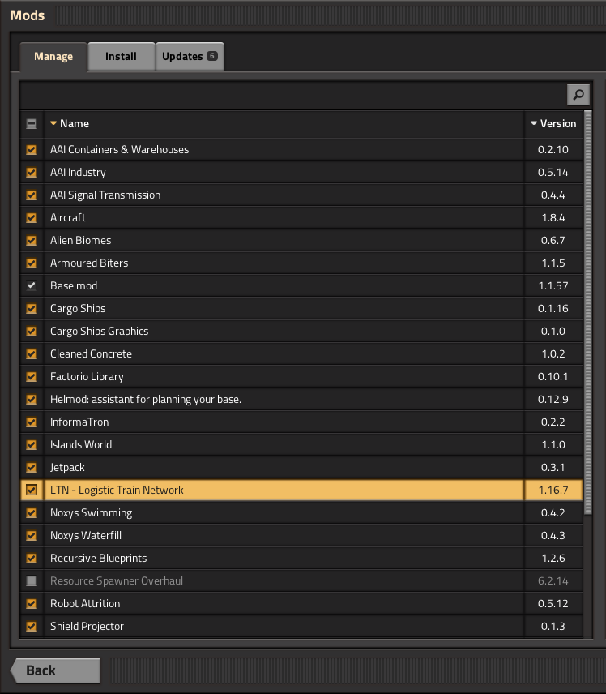
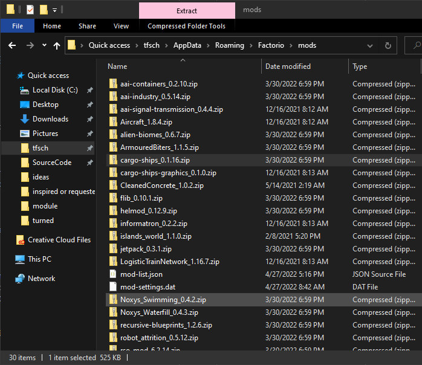
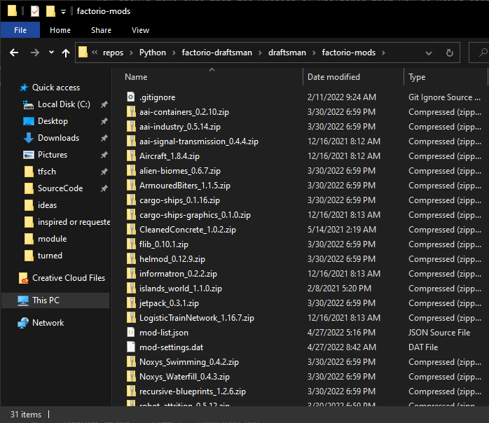

How to use mods with Draftsman
==============================

Installing mods
---------------

Adding mods to Draftsman is about as easy as installing mods for Factorio itself.
First, we need to determine exactly which mods we want to work with.
Mods can be downloaded directly from `<https://mods.factorio.com/>`_, but an easier method is to use Factorio's in-game mod browser itself:

Select the mods that you want, then press the Install button to automatically download and install the mods and their dependencies.
You can also setup any user configuration that you want, such as enabling or disabling specific mods, or changing mod specific settings; these changes will be reflected in Draftsman. (As long as they affect the data stage only!)

.. image:: ../../img/handbook/modding/factorio_mod_settings.png
    :alt: Factorio's mod settings, available in Settings > Mod Settings

Then, navigate to the Factorio mods folder. This is usually located somewhere in your home directory.
For example, on Windows your mods should be located in ``C:\Users\your_name\AppData\Roaming\Factorio\mods``:

Next, determine where your Draftsman installation is located.
If you installed Draftsman in a virtual environment it should be located in a ``Lib/site-packages`` folder somewhere in your development directory.
If you installed it to your computer's python installation, check to see where that's installed (depending on your OS) and look for the same ``site-packages`` folder.
You should make sure that the version of Draftsman that you're using corresponds the the installation location you put the mods, if you have multiple instances of Draftsman installed.

In that folder you should find a folder titled ``draftsman``, and inside that a folder named ``factorio-mods``:

Copy and paste the contents from your Factorio mods folder to the ``factorio-mods`` folder in ``draftsman``.
You should include the ``mod-settings.dat`` and ``mod-list.json`` files, as they hold the mod configuration settings you specified in Factorio.
Any other file that does not end with ``.zip`` will be ignored.

.. NOTE::

    In Factorio, mods can be loaded as either a zip file, or as a folder.
    Currently, Draftsman can only properly load zip files, though it will be able to load mod folders as well in the future.
    A workaround for now is to simply wrap the mod folder in a zip file, according the the `mod naming conventions <https://wiki.factorio.com/Tutorial:Mod_structure#Mod_folder_and_file_structure>`_.

Then, to resolve these changes simply run ``draftsman-update``.
Again, make sure you're running the correct ``draftsman-update`` for the version of Draftsman that you installed the mods into.
You can use the ``--verbose`` or ``-v`` flag to get more information about the load process.
The following is the verbose output of the modlist above:

.. code-block:: console

    (.venv) $ draftsman-update --verbose
    aai-containers 0.2.10
    dependencies:
            base >= 1.1.0
    aai-industry 0.5.14
    dependencies:
            base >= 1.1.0
            ? aai-containers >= 0.1.1
            ? InserterFuelLeech >= 0.2.6
            ? angelsrefining
            ? IndustrialRevolution >= 2.2.3
    aai-signal-transmission 0.4.4
    dependencies:
            base >= 1.1.0
    Aircraft 1.8.4
    dependencies:
            base >= 1.1.0
            ? bobplates >= 1.1.0
            ? bobelectronics >= 1.1.0
            ? boblibrary >= 1.1.0
            ? bobwarfare >= 1.1.0
            ? bobvehicleequipment >= 1.1.0
            ! traintunnels <= 0.0.11
    alien-biomes 0.6.7
    dependencies:
            base >= 1.1.0
            ? alien-biomes-hr-terrain >= 0.3.1
    ArmouredBiters 1.1.5
    dependencies:
            base >= 1.1.1
            ? alien-biomes
    cargo-ships-graphics 0.1.0
    dependencies:
            base >= 1.1
            ~ cargo-ships >= 0.1.0
    cargo-ships 0.1.16
    dependencies:
            base >= 1.1
            cargo-ships-graphics >= 0.1.0
            ? factorio-world >= 1.0.2
            ? NewIslands >= 0.1.0
            ? islands_world >= 1.1.0
            ? SeaBlock >= 0.5.5
            ? Hovercraft >= 0.0.1
            ? Hovercrafts >= 1.1.0
            ? angelspetrochem >= 0.9.17
            ? ctg >= 0.4.3
            ? Krastorio2 >= 1.0.18
            ! cargo-ships-seraph
            ? rso-mod
    CleanedConcrete 1.0.2
    dependencies:
            base >= 0.18.0
    flib 0.10.1
    dependencies:
            ? base >= 1.1.35
    helmod 0.12.9
    dependencies:
            base >= 1.1
    informatron 0.2.2
    dependencies:
            base >= 1.1.0
    islands_world 1.1.0
    dependencies:
            base >= 0.15
    jetpack 0.3.1
    dependencies:
            base >= 1.1.0
            ? PickerTweaks
    LogisticTrainNetwork 1.16.7
    dependencies:
            base >= 1.1.46
            flib >= 0.6.0
            ? cargo-ships
    Noxys_Swimming 0.4.2
    dependencies:
            base >= 1.1.0
    Noxys_Waterfill 0.4.3
    dependencies:
            base >= 1.1.50
    recursive-blueprints 1.2.6
    dependencies:
            base
    robot_attrition 0.5.12
    dependencies:
            base >= 1.1.0
    shield-projector 0.1.3
    dependencies:
            base >= 1.1.0
    space-exploration-graphics-2 0.1.2
    dependencies:
            base >= 1.1.0
    space-exploration-graphics-3 0.1.1
    dependencies:
            base >= 1.1.0
    space-exploration-graphics-4 0.1.1
    dependencies:
            base >= 1.1.0
    space-exploration-graphics-5 0.1.2
    dependencies:
            base >= 1.1.0
    space-exploration-graphics 0.5.15
    dependencies:
            base >= 1.1.0
    space-exploration-postprocess 0.5.29
    dependencies:
            base >= 1.1.0
            ? space-exploration >= 0.5.104
            ? angelsbioprocessing
            ? angelsindustries
            ? angelspetrochem
            ? angelsrefining
            ? angelssmelting
            ? bobassembly
            ? bobelectronics
            ? bobenemies
            ? bobgreenhouse
            ? bobinserters
            ? boblogistics
            ? bobmining
            ? bobmodules
            ? bobores
            ? bobplates
            ? bobpower
            ? bobrevamp
            ? bobtech
            ? bobvehicleequipment
            ? bobwarfare
            ? Darkstar_utilities
            ? Darkstar_utilities_Low_Spec-0_17-Port
            ? Decktorio
            ? k2se-compatibility
            ? Krastorio2 >= 1.2.22
            ? NPUtils
            ? qol_research
            ? reverse-factory >= 6.0.5
            ? SpaceMod
            ? Yuoki
    space-exploration 0.5.112
    dependencies:
            base >= 1.1.50
            aai-industry >= 0.5.3
            alien-biomes >= 0.6.4
            jetpack >= 0.2.6
            robot_attrition >= 0.5.9
            shield-projector >= 0.1.2
            space-exploration-graphics >= 0.5.15
            space-exploration-graphics-2 >= 0.1.2
            space-exploration-graphics-3 >= 0.1.1
            space-exploration-graphics-4 >= 0.1.1
            space-exploration-graphics-5 >= 0.1.2
            ~ space-exploration-postprocess >= 0.5.28
            informatron >= 0.2.1
            aai-signal-transmission >= 0.4.1
            ? aai-containers >= 0.2.7
            ? bullet-trails >= 0.6.1
            ? grappling-gun >= 0.3.1
            ? combat-mechanics-overhaul >= 0.6.15
            ? equipment-gantry >= 0.1.1
            ! angelsindustries
            ! angelspetrochem
            ! angelsrefining
            ! angelssmelting
            ! bobelectronics
            ! bobores
            ! bobplates
            ! bobpower
            ! bobrevamp
            ! bobtech
            ! bobvehicleequipment
            ! bobwarfare
            ! Yuoki
            ! pycoalprocessing
            ! pyindustry
            ! pyhightech
            ! ab_logisticscenter
            ! angelsinfiniteores
            ! BasicSeaBlock
            ! BitersBegone
            ! BitersBegoneUpdated
            ! bobmodules
            ! bulkteleport
            ! Clockwork
            ! dangOreus
            ! Darkstar_utilities
            ! dark-matter-replicators
            ! dark-matter-replicators-0_17-port
            ! DeepMine
            ! endlessresources
            ! ExplosiveExcavation
            ! FactorioExtended-Core
            ! FactorioExtended-Plus-Core
            ! IndustrialRevolution
            ! IndustrialRevolution2
            ! inf_res
            ! infinite-resources-depletion
            ! ItemTeleportation
            ! LandfillPainting
            ! Li-Quarry
            ! modmash
            ! MoreScience
            ! MoreSciencePacks
            ! omnimatter
            ! OnlyReds
            ! PersonalTeleporter
            ! pickerextended
            ! pickerinventorytools
            ! PlacePump
            ! PumpAnywhere
            ! PyBlock
            ! quarry
            ! quarry-edit
            ! railgun_revival
            ! rso-mod
            ! SeaBlock
            ! SchallMachineScaling
            ! SchallOreConversion
            ! sonaxaton-infinite-resources
            ! Space-Exploration-Modpack
            ! SpaceMod
            ! TagToTeleport
            ! TeamCoop
            ! Teleportation_Redux
            ! traintunnels
            ! Unlimited-Resources
            ! UnlimitedProductivity
            ! vtk-deep-core-mining
            ! warptorio
    Load order:
    ['base', 'Aircraft', 'CleanedConcrete', 'Noxys_Swimming', 'Noxys_Waterfill', 'aai-containers', 
    'aai-signal-transmission', 'alien-biomes', 'cargo-ships-graphics', 'flib', 'helmod', 'informatron', 
    'islands_world', 'jetpack', 'recursive-blueprints', 'robot_attrition', 'shield-projector', 
    'space-exploration-graphics', 'space-exploration-graphics-2', 'space-exploration-graphics-3', 
    'space-exploration-graphics-4', 'space-exploration-graphics-5', 'ArmouredBiters', 'aai-industry', 
    'cargo-ships', 'LogisticTrainNetwork', 'space-exploration', 'space-exploration-postprocess']
    SETTINGS.LUA:
            mod: Aircraft
            mod: Noxys_Swimming
            mod: Noxys_Waterfill
            mod: aai-containers
            mod: alien-biomes
            mod: flib
            mod: helmod
            mod: informatron
            mod: jetpack
            mod: recursive-blueprints
            mod: robot_attrition
            mod: ArmouredBiters
            mod: aai-industry
            mod: cargo-ships
            mod: LogisticTrainNetwork
            mod: space-exploration
    SETTINGS-UPDATES.LUA:
            mod: cargo-ships
    SETTINGS-FINAL-FIXES.LUA:
    DATA.LUA:
            mod: base
            mod: Aircraft
            mod: CleanedConcrete
            mod: Noxys_Swimming
            mod: Noxys_Waterfill
            mod: aai-containers
            mod: aai-signal-transmission
            mod: alien-biomes
            mod: flib
            mod: helmod
            mod: informatron
            mod: islands_world
            mod: jetpack
            mod: recursive-blueprints
            mod: robot_attrition
            mod: shield-projector
            mod: ArmouredBiters
            mod: aai-industry
            mod: cargo-ships
            mod: LogisticTrainNetwork
            mod: space-exploration
            mod: space-exploration-postprocess
    DATA-UPDATES.LUA:
            mod: base
            mod: Aircraft
            mod: Noxys_Waterfill
            mod: alien-biomes
            mod: islands_world
            mod: recursive-blueprints
            mod: robot_attrition
            mod: aai-industry
            mod: cargo-ships
            mod: space-exploration
    DATA-FINAL-FIXES.LUA:
            mod: aai-containers
            mod: alien-biomes
            mod: jetpack
            mod: robot_attrition
            mod: aai-industry
            mod: cargo-ships
            mod: LogisticTrainNetwork
            mod: space-exploration
            mod: space-exploration-postprocess
    Extracted mods...
    Extracted entities...
    Extracted instruments...
    Extracted items...
    Extracted modules...
    Extracted recipes...
    Extracted signals...
    Extracted tiles...
    Update finished.
    hella slick; nothing broke!

Writing scripts with mods
-------------------------

After the command has finished, all the correct data and prototypes should be loaded.
This means that you can create new instances of modded entities exactly as if they were vanilla ones:

.. code-block:: python

    from draftsman.entity import new_entity
    from draftsman.data import entities

    # For example, let create the "blueprint-deployer" entity from Recursive Blueprints
    deployer = new_entity("blueprint-deployer")
    print(deployer)
    # <Container>{'name': 'blueprint-deployer', 'position': {'x': 0.5, 'y': 0.5}}
    assert deployer.inventory_size == 1
    assert deployer.inventory_bar_enabled == False
    # deployer.bar = 10 # DraftsmanError: This entity does not have bar control

    # Lets see what the new list of containers are, now that we include mods
    print(entities.containers)
    # ['steel-chest', 'iron-chest', 'wooden-chest', 'aai-strongbox', 'aai-storehouse', 
    # 'aai-warehouse', 'blueprint-deployer', 'se-rocket-launch-pad', 'se-rocket-landing-pad', 
    # 'se-delivery-cannon-chest', 'se-cargo-rocket-cargo-pod', 'aai-big-ship-wreck-1', 
    # 'big-ship-wreck-1', 'aai-big-ship-wreck-2', 'big-ship-wreck-2', 'aai-big-ship-wreck-3', 
    # 'big-ship-wreck-3', 'aai-medium-ship-wreck-1', 'aai-medium-ship-wreck-2', 'blue-chest', 
    # 'red-chest', 'se-cartouche-chest', 'factorio-logo-11tiles', 'factorio-logo-16tiles', 
    # 'factorio-logo-22tiles']

However, note that the converse is not necessarily true; If you have the mod enabled, then you can create a modded entity, but if you share that script with another user who doesn't have those mods enabled, the script will fail with an :py:exc:`.InvalidEntityError`.

To handle this case more elegantly, there exists a :py:mod:`.mods` module that indexes the currently enabled mods and their versions (`similar to Factorio's modding API <https://lua-api.factorio.com/latest/Data-Lifecycle.html#:~:text=game%20provides%20the-,mods,-table%20which%20contains>`_). 

.. code-block:: python

    from draftsman.data import mods

    print(mods.mod_list)
    # {
    #     'base': (1, 1, 57, 0), # This is the Factorio version, which is treated as a "mod"
    #     'aai-containers': (0, 2, 10), 
    #     'aai-industry': (0, 5, 14), 
    #     'aai-signal-transmission': (0, 4, 4), 
    #     'Aircraft': (1, 8, 4), 
    #     'alien-biomes': (0, 6, 7), 
    #     'ArmouredBiters': (1, 1, 5), 
    #     'cargo-ships-graphics': (0, 1, 0), 
    #     'cargo-ships': (0, 1, 16), 
    #     'CleanedConcrete': (1, 0, 2), 
    #     'flib': (0, 10, 1), 
    #     'helmod': (0, 12, 9), 
    #     'informatron': (0, 2, 2), 
    #     'islands_world': (1, 1, 0), 
    #     'jetpack': (0, 3, 1), 
    #     'LogisticTrainNetwork': (1, 16, 7), 
    #     'Noxys_Swimming': (0, 4, 2), 
    #     'Noxys_Waterfill': (0, 4, 3), 
    #     'recursive-blueprints': (1, 2, 6), 
    #     'robot_attrition': (0, 5, 12), 
    #     'shield-projector': (0, 1, 3), 
    #     'space-exploration-graphics-2': (0, 1, 2), 
    #     'space-exploration-graphics-3': (0, 1, 1), 
    #     'space-exploration-graphics-4': (0, 1, 1), 
    #     'space-exploration-graphics-5': (0, 1, 2), 
    #     'space-exploration-graphics': (0, 5, 15), 
    #     'space-exploration-postprocess': (0, 5, 29), 
    #     'space-exploration': (0, 5, 112)
    # }

You can use this to ensure that the mods needed for the script's operation are present and of the correct version, and issue more helpful messages when they are not:

.. code-block:: python

    from draftsman.entity import Container
    from draftsman.data import mods
    from draftsman.error import MissingModError

    if not mods.mod_list.get("recursive-blueprints", False):
        raise MissingModError("The Recursive Blueprints mod is needed for this script")

    deployer = Container("blueprint-deployer")
    # ...

Limitations of mods
-------------------

Draftsman (currently) only implements the Settings and Data stage of the data lifecycle. 
This means that any mod functionality that lies outside of that stage is not considered or available to the programmer.
This includes custom hooks for placing entities, removing entities, on game load, unload, and any other per world or instance operation.

A good example of this is the Cargo Rocket Launchpad from the `Space Exploration <https://mods.factorio.com/mod/space-exploration>`_ modpack; This entity has a set of metadata associated with its ``tags`` attribute that is generated when it is placed in the world. 
This behavior has to be manually mimicked by a script writer in order to get the intended functionality of the entity; there is currently no mechanism to "query" what should happen to the entity when it's placed in the world, or, harder yet, integrate these attributes as part of the structure of the class. 
It would be convenient to be able to specify a ``destination_location`` attribute for rocket launchpad, but at the moment this relies on the user to implement a custom ``Container`` entity with this behavior, and is not something to be expected to be automatically generated by Draftsman.

Potential Errors
----------------

Draftsman's loading process was designed with how Factorio loads it's data in mind, with the intention of being identical.
However, this implementation is most likely incomplete across a number of edge cases, and I have only been able to test it's functionality with a handful of mods.
If you use Draftsman and come across an error that does not happen when loading the same mods with the same configuration in Factorio itself, please leave a `issue so I can track and resolve it <https://github.com/redruin1/factorio-draftsman/issues>`_.