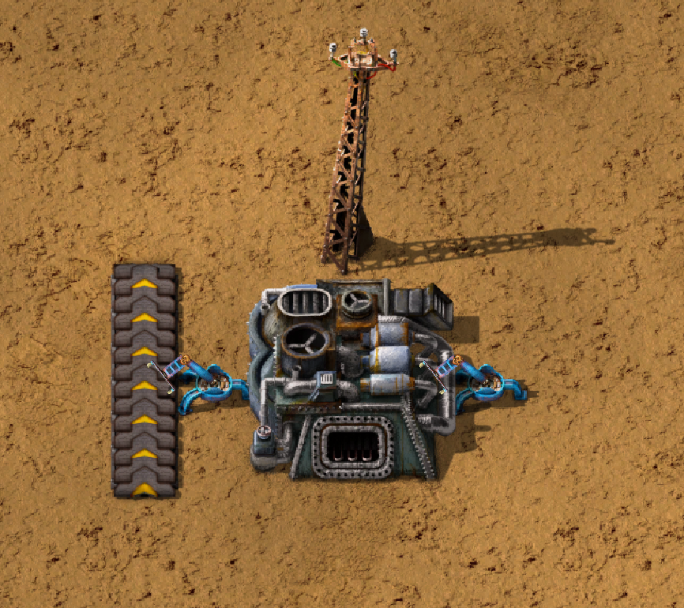
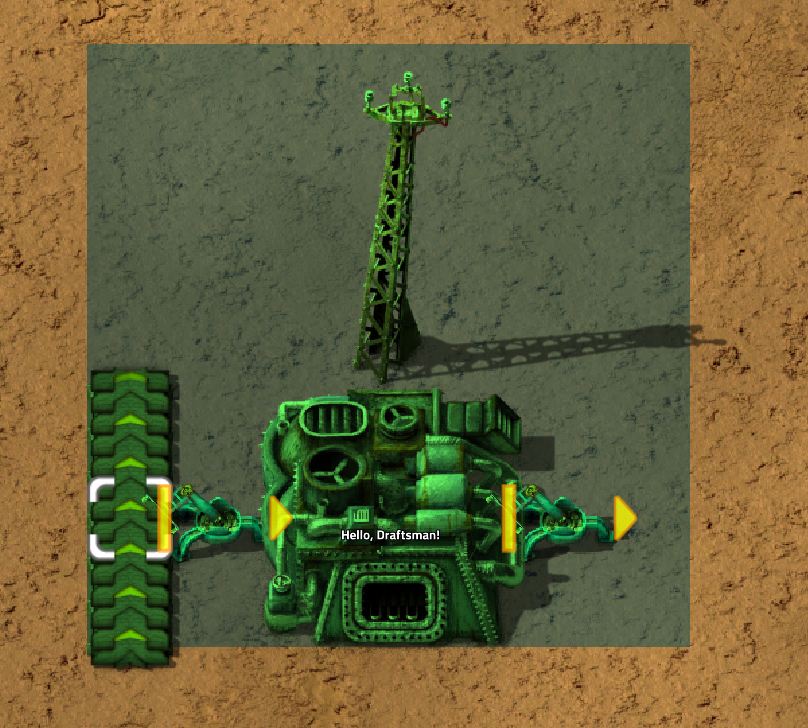
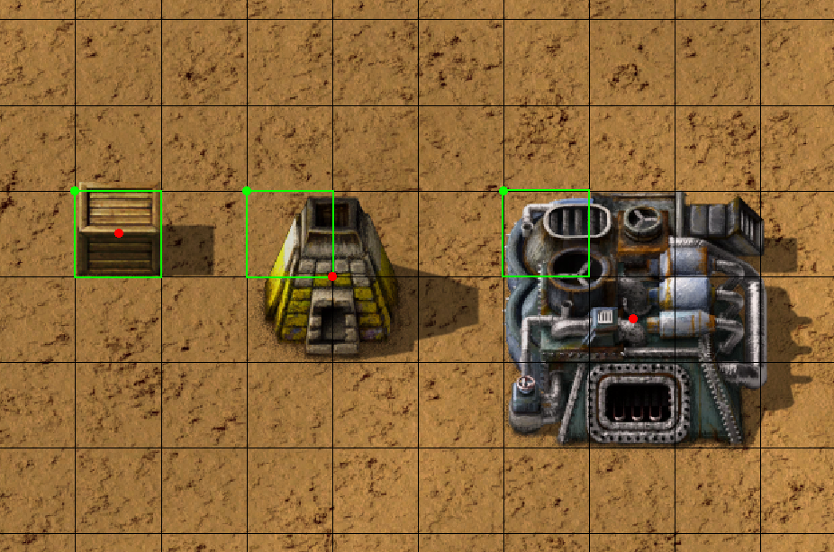
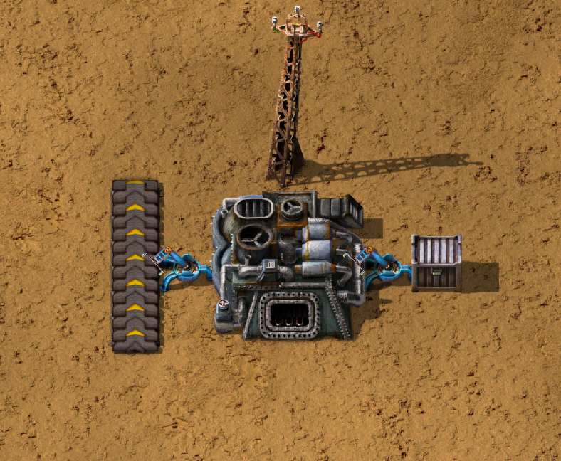
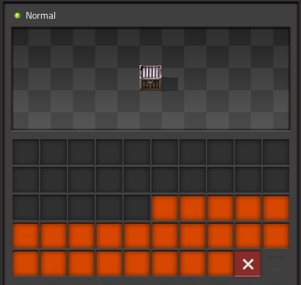

Quickstart
==========

Installation
------------

Like many Python modules, Draftsman is easy to install. 
First, install the module from PyPI:

.. code-block:: console

    (.venv) $ pip install factorio-draftsman

Once that's complete, we need to initialize the modules data.
Draftsman comes pre-packaged with the latest version of Factorio's data, which needs to be initialized once on startup.
Draftsman has the console command ``draftsman-update`` to do exactly this:

.. code-block:: console

    (.venv) $ draftsman-update

Once this command finishes, if you see the output ``hella slick; nothing broke!`` then you can be sure that the process went smoothly.

.. NOTE::
    
    **In order for the module to be set up correctly, both of the above commands must be run.**

.. NOTE::

    ``draftsman-update`` comes with a number of options, which you can view with ``draftsman-update -h`` or ``draftsman-update --help``.
    One such option is ``-v`` or ``--verbose``, which displays more detailed information on the process.

Creating a Blueprint
--------------------

In order to show off how to use Draftsman, let's create a blueprint to play around with:

And here's it's blueprint string:

.. code-block::

    0eNqd0ttqwzAMBuB30bVTloOT1q9SxshBHYJECbYyFoLffU4GYWPuNnop+/dn2WiFpp9xssQCZgVqR3Zgris4euW639ZkmRAMkOAACrgetgp7bMVSm9xmy3WL4BUQd/gOJvXPCpCFhPDT2ovlheehQRsChyK2ZjeNVpIGewn6NLpwbOTt3o2q8pNWsIBJLsVJe69+YNn9liJceXB5nMsPbsCO5iE51Gns/yB1nCweeu6d/vRDWBbHygO71U4SYodWwkbEKr41pqAjG/5lT5QRufq/fP5NDpO0z535MqYK3tC6PZCd06K6ZJVOdZqXT95/AMv66Tw=

Factorio blueprint strings are simply zlib compressed JSON text files, which can be easily decoded into Python dictionaries and re-encoded after modification. 
Let's start off simple by doing just that:

.. code-block:: python

    from draftsman import utils

    # Paste the blueprint string here
    bp_string = "..."

    # Convert the blueprint string to a Python dictionary
    blueprint_dict = utils.string_to_JSON(bp_string)

    # Set or add the label (title) of the blueprint
    blueprint_dict["blueprint"]["label"] = "Hello, Draftsman!"
    print(blueprint_dict, "\n")
    
    # Re-encode the modifications and print to user
    output_string = utils.JSON_to_string(blueprint_dict)
    print(output_string)

When we import this string into Factorio, we get the same blueprint again but with it's name changed to "Hello, Draftsman!"

For some users, these two functions `and this page <https://wiki.factorio.com/Blueprint_string_format>`_ are all they need to complete their Factorio blueprint related project. 
Technically, that's all you need; blueprint strings are just JSON dicts after all. 
However, Draftsman intends to be far more than just 4 lines of code!

Lets start by instead of loading the blueprint string into a raw dict, we load it into a :py:class:`.Blueprint` instance:

.. code-block:: python

    from draftsman.blueprintable import Blueprint

    bp_string = "..."
    
    # Create a Blueprint object
    blueprint = Blueprint(bp_string)

    blueprint.label = "Hello, Draftsman!"

    print(blueprint)
    print(blueprint.to_string())

``Blueprint`` allows the user to modify almost all components of the blueprint by attribute, as shown with :py:attr:`~.Blueprint.label` above. 
``Blueprint`` also provides methods that operate on itself, such as the :py:meth:`~.Blueprint.to_string` function, as well as a prettier string representation using the Python standard library ``json``.

``Blueprint`` can also be accessed by key just like the previous dict example, and is identical for most keys.
(:ref:`Read here for more info on the differences. <handbook.blueprints.blueprint_differences>`)

.. testsetup::

    from draftsman.blueprintable import Blueprint
    blueprint = Blueprint()
    from draftsman.entity import Container
    from draftsman.classes.vector import Vector

.. doctest::

    # Note that there's no type checking when doing this.
    >>> blueprint["label"] = "Hello, draftsman!" 
    >>> assert blueprint.label is blueprint["label"]

Draftsman strives to be *"Factorio-safe"*, meaning that if the blueprint string raises an error on import, it should raise an error in script. 
This can be demonstrated by attempting to set the label to anything other than a string:

.. doctest::

    >>> blueprint.label = False
    Traceback (most recent call last):
       ...
    TypeError: 'label' must be a string or None

Draftsman uses ``None`` as a special value to represent either 'no-value' or 'default-value', and sometimes removes elements from the internal structure depending on the attribute. 
This is safer than using ``del`` as often-times attributes are required for certain operations, and most of the time the user doesn't actually want to *delete* an attribute, rather, just set it to nothing.
We can showcase this by using the above example once more and set ``label`` to ``None``:

.. doctest::

    >>> blueprint.label = None
    >>> assert "label" not in blueprint

In this case, the ``"label"`` key is removed from the blueprint structure when we set it to ``None``, deleting it. 
Thus, if the imported blueprint string already had its label set before we imported it, it will be removed.

Adding Entities
---------------

Now let's say we want to add a steel chest to our blueprint to hold the output of the furnace. 
One can manually change the blueprint dict to what we need to output:

.. code-block:: python

    # Note: Don't do this. There are other reasons not to do this, even aside from the obvious ones.
    blueprint.entities.append(
        {
            "name": "steel-chest",
            "position": "..."
        }
    )

But we've been down this road once before. Enter: the :py:class:`.Entity` class! 
Or, rather, base class. 
For simplicity's sake we'll ignore ``Blueprint`` for the moment and focus on just entities.

.. code-block:: python 

    from draftsman.entity import Container

    # Create a Container instance, which is a child of Entity.
    container = Container("steel-chest")

:py:class:`.Container` is a type of ``Entity``, used for holding items and typically includes all the regular chests. 
The first positional argument to any entity is always it's name. 
It's name has to match the name of a valid Factorio name, otherwise it will raise an :py:class:`.InvalidEntityError`. 
You can query exactly what the valid names for containers are by checking :py:data:`draftsman.data.entities.containers`:

.. doctest::

    >>> from draftsman.data import entities
    >>> print(entities.containers)
    ['wooden-chest', 'iron-chest', 'steel-chest', 'big-ship-wreck-1', 'big-ship-wreck-2', 'big-ship-wreck-3', 'blue-chest', 'red-chest', 'factorio-logo-11tiles', 'factorio-logo-16tiles', 'factorio-logo-22tiles']

Doing so gives you all valid entities of that type; the example above is a likely output with a vanilla installation of Draftsman.

.. Note::
    :py:data:`.entities.containers` and all other "entity lists" include *hidden* items, as well as items that exist internally that are not craftable or otherwise available, such as (in the case of Container) the Factorio logo entities. 
    This is done for completeness sake, as it is hard to distinguish 'unwanted' entities, especially since 'unwanted' is contextual. 
    Keep this in mind before blindly iterating over these lists expecting only the visible entities.

Sometimes, for singleton entities it can be redundant to specify the name for an entity if it's going to be the same every time. 
Take :py:class:`.ProgrammableSpeaker` for example: in most cases, there is only going to be one entity of that type. 
As a result, all entities have a default name which is the first index of the entity list for that type:

.. doctest::

    >>> from draftsman.entity import ProgrammableSpeaker
    >>> from draftsman.data import entities

    >>> speaker = ProgrammableSpeaker()
    >>> assert speaker.name == "programmable-speaker"
    >>> assert speaker.name == entities.programmable_speakers[0]

This feature also works for all other entities as well, not just singletons:

.. doctest::
    
    >>> from draftsman.entity import *
    >>> from draftsman.data import entities

    # Keep in mind that this is with no mods
    >>> container = Container()
    >>> assert container.name == "wooden-chest"

.. Note::
    The order of each entity list is determined by the `Factorio sort order <https://forums.factorio.com/viewtopic.php?p=23818#p23818>`_.
    Simply put, items are sorted first by their group, subgroup, and then item order strings. 
    If the entity has no item order string, it is sorted by entity order string, and, failing that, entity name.
    This is the order that you see when you look in the crafting menu in-game:

    .. image:: ../img/quickstart/crafting_menu.png

    You can see that because "wooden-chest" is to the left of "iron-chest", "wooden-chest" will always be before "iron-chest" in ``entities.containers`` (Unless some mod messes with their order strings!)
    
    Because the order is highly dependent on what mods the user might have, it's
    not portable to rely on defaults to be any specific entity, so while it is
    an option for simple scripts, in general: "explicit is better than implicit."

Sometimes we might know what the name of an entity is, but not its internal type.
As a result, there exists the factory function :py:func:`.new_entity` for this exact situation:

.. doctest::

    >>> from draftsman.entity import new_entity, Container

    >>> any_entity = new_entity("steel-chest")
    >>> assert isinstance(any_entity, Container)

All entities need two things: their name, which we just covered, and a position.
Entity objects actually have two commonly used coordinates that are updated in tandem: :py:attr:`~.Entity.position` and :py:attr:`~.Entity.tile_position`.
The ``position`` of an entity is in floating point coordinates and is the traditional implementation of its position; it usually lies directly at the center of the entity, either sitting in the middle of the tile grid or on its transition.
The ``tile_position`` of an entity is in integer coordinates and is the position of the top-leftmost tile covered by the entity.

    
    The red dots represent the ``position``, the green dots the ``tile_position``, and the green squares the associated tile at ``tile_position``.

If no position for the entity is specified, it defaults to ``tile_position`` (0, 0). Its absolute position is then deduced from its :py:attr:`~.Entity.tile_width` and :py:attr:`~.Entity.tile_height`:

.. doctest::

    >>> container = Container("steel-chest")
    >>> print(container.tile_position)
    (0, 0)
    >>> print((container.tile_width, container.tile_height))
    (1, 1)
    >>> print(container.position)
    (0.5, 0.5)

As shown, both ``position`` and ``tile_position`` are instances of :py:class:`.Vector`, which is a standard 2D vector with an ``x`` and ``y`` attribute.
You can specify either parameter and the other will update to the proper value:

.. doctest::

    >>> container = Container("steel-chest")
    >>> container.position = Vector(10.5, 10.5)
    >>> print(container.tile_position)
    (10, 10)

Because the explicit ``Vector`` constructor form is a little unweildly, you can also specify either position type as a sequence, usually a list or tuple:

.. doctest::

    # Note that the data format still remains a dict with x and y keys
    # after assignment.
    
    # Tuple
    >>> container.position = (15.5, 45.5)
    >>> container.position
    <Vector>(15.5, 45.5)
    
    # List
    >>> container.tile_position = [2, 3]
    >>> container.tile_position
    <Vector>(2, 3)
    
For compatibility, you can also specify ``position`` or ``tile_position`` as a ``dict`` with ``"x"`` and ``"y"`` keys to match the format of the underlying dictionary.

.. doctest::

    >>> container.position = {"x": -10.5, "y": 10.5}
    >>> container.position
    <Vector>(-10.5, 10.5)

You can specify these parameters in the constructor to immediately set the Entity's position as well:

.. doctest::

    >>> container1 = Container("steel-chest", tile_position = (-5, 10))
    >>> container2 = Container("iron-chest", position = {"x": 10.5, "y": 15.5})

.. Note::

    All attributes of an Entity can be set as a keyword in its constructor.
    This is done so you can take existing entity dictionaries and directly pass them into an Entity constructor as keyword arguments:

    .. doctest::

        >>> example = {
        ...     "name": "iron-chest",
        ...     "position": (0.5, 0.5),
        ...     # any other valid attribute...
        ... }

        >>> container = Container(**example)
        >>> container.position
        <Vector>(0.5, 0.5)

        >>> # This also works with new_entity():
        >>> any_entity = new_entity(**example)
        >>> any_entity.name
        'iron-chest'
        >>> any_entity.type
        'container'

        # and blueprint.entities.append() as well:
        >>> blueprint.entities.append(**example)
        >>> blueprint.entities[-1].name
        'iron-chest'

We want to position the container such that the output inserter feeds into it.
But what coordinate is that?
We have to figure out exactly where the rest of the entities are before we know where to put the steel chest.
We could grab a random entity in :py:attr:`.blueprint.entities` to get a rough idea, but let's do something a little more sophisticated instead:

.. testsetup:: group3

    from draftsman.blueprintable import Blueprint
    from draftsman.entity import Container

    bp_string = "0eNqd0ttqwzAMBuB30bVTloOT1q9SxshBHYJECbYyFoLffU4GYWPuNnop+/dn2WiFpp9xssQCZgVqR3Zgris4euW639ZkmRAMkOAACrgetgp7bMVSm9xmy3WL4BUQd/gOJvXPCpCFhPDT2ovlheehQRsChyK2ZjeNVpIGewn6NLpwbOTt3o2q8pNWsIBJLsVJe69+YNn9liJceXB5nMsPbsCO5iE51Gns/yB1nCweeu6d/vRDWBbHygO71U4SYodWwkbEKr41pqAjG/5lT5QRufq/fP5NDpO0z535MqYK3tC6PZCd06K6ZJVOdZqXT95/AMv66Tw="
    
    # Create a Blueprint object
    blueprint = Blueprint(bp_string)

    blueprint.label = "Hello, Draftsman!"

    container = Container("steel-chest")

.. doctest:: group3

    >>> furnace = blueprint.find_entities_filtered(name = "electric-furnace")[0]
    >>> print(furnace) 
    <Furnace>{'name': 'electric-furnace', 'position': {'x': 176.5, 'y': -93.5}}

Anyone familiar with the `LuaSurface API <https://lua-api.factorio.com/latest/LuaSurface.html#LuaSurface.find_entities_filtered>`_ might recognize this function.
This rendition searches the entities in the blueprint with a set of criteria and returns the list of entities that match.
Here, we search for any entity with the name ``"electric-furnace"``, which will give us a nice anchor to read from as we know there is only one in the blueprint.

Since we now know that the center of the furnace is at (176.5, -93.5), we can simply set the container 3 tiles to the right to place it correctly. We can add a tuple (or list or dict) to the furnace position and set the resulting vector to the container's position:

.. doctest:: group3

    >>> container.position = furnace.position + (3, 0)

    # Now we can add it to the blueprint
    >>> blueprint.entities.append(container)

And presto!

Specifying the blueprint in absolute coordinates can feel somewhat clunky though.
It might be slicker to move the entire blueprint from its absolute position to a normalized position, such as around the origin.
This would make the positions consistent, regardless of where the blueprint was originally constructed.
Lets use :py:meth:`.Blueprint.translate` to do just that:

.. doctest:: group3

    # Lets say we want to set the blueprint origin to the middle tile of the
    # 3x3 electric furnace
    # First, lets get the tile position of the furnace (which is it's top left 
    # corner) and add 1 to each coordinate to get its center tile
    >>> center = furnace.tile_position + (1, 1)
    
    # Now we translate in the opposite direction to make that point the origin
    >>> blueprint.translate(-center.x, -center.y)
    >>> print(furnace.tile_position)
    (-1, -1)

    # Now we can specify the container at tile position (3, 0) and get the same result as before.
    >>> container.tile_position = (3, 0)
    >>> blueprint.entities.append(container)
    
.. Note::

    Draftsman follows Factorio's coordinate system, in which positive X is right and positive Y is down.

Lets change one more of the Container's attributes to illustrate one more concept about Draftsman.
Suppose we want to set the limiting bar to limit half the inventory:

.. code-block:: python

    # We can set it using the bar attribute:
    container.bar = 24 # (48 / 2)

.. Note::
    
    All methods and attributes in Draftsman use **0-indexed notation unless 
    otherwise specified.**

However, what if we didn't know that a steel-chest has 48 slots? 
Or what if steel-chest's inventory size was changed by some mod? 
Instead, we can write something like this:

.. code-block:: python

    container = Container("whatever-container-we-want")
    # Note: container.inventory_size is read only
    container.bar = int(container.inventory_size / 2)

which works with every Container (even modded ones!):

.. image:: ../img/quickstart/all_default_container_inventories.png

Being *"Factorio-safe"* also applies to entities. 
If we were to set the bar to be anything other than an unsigned short, Factorio would throw a fit. 
Thus, Draftsman throws an error right when we make the mistake:

.. doctest:: group3

    >>> container.bar = -1
    Traceback (most recent call last):
       ...
    IndexError: 'bar' not in range [0, 65536)

However, what if we were to set the index to a number within that range, but greater than the number of inventory slots? 
Factorio swallows this, simply acting as if the bar index was not set, but does so *silently*; which, if such a component is critical, can be hard to catch. 
Wouldn't it be better to be notified of such a mistake without necessarily affecting program function?

As a result, in addition to attempting to be *"Factorio-safe"*, Draftsman also attempts to be *"Factorio-correct"*: If some component or attribute does not break the importing/exporting process, but either doesn't make sense or fails to achieve the desired effect, a warning is raised:

.. doctest:: group3

    >>> container.bar = 100 # IndexWarning: 'bar' not in range [0, 48)

Thus, we can now see our mistake and fix it. Or, we can just ignore it:

.. code-block:: python

    import warnings
    from draftsman.warning import IndexWarning, DraftsmanWarning

    # We can choose to ignore just this specific warning
    warnings.simplefilter("ignore", IndexWarning)
    # Or we can ignore all warnings issued by Draftsman
    warnings.simplefilter("ignore", DraftsmanWarning)

    container.bar = 100 # Peace and quiet.

With all the components discussed, we can finally put all the pieces together.
Here's a full working example:

.. code-block:: python

    from draftsman.blueprintable import Blueprint
    from draftsman.entity import Container

    bp_string = "0eNqd0ttqwzAMBuB30bVTloOT1q9SxshBHYJECbYyFoLffU4GYWPuNnop+/dn2WiFpp9xssQCZgVqR3Zgris4euW639ZkmRAMkOAACrgetgp7bMVSm9xmy3WL4BUQd/gOJvXPCpCFhPDT2ovlheehQRsChyK2ZjeNVpIGewn6NLpwbOTt3o2q8pNWsIBJLsVJe69+YNn9liJceXB5nMsPbsCO5iE51Gns/yB1nCweeu6d/vRDWBbHygO71U4SYodWwkbEKr41pqAjG/5lT5QRufq/fP5NDpO0z535MqYK3tC6PZCd06K6ZJVOdZqXT95/AMv66Tw="

    blueprint = Blueprint(bp_string)
    blueprint.label = "Hello, draftsman!"

    # Normalize coordinates to furnace center
    furnace = blueprint.find_entities_filtered(type = "furnace")[0]
    center = [furnace.tile_position["x"] + 1, furnace.tile_position["y"] + 1]
    blueprint.translate(-center[0], -center[1])

    # Create our new entity
    container = Container("steel-chest", tile_position = (3, 0))
    container.bar = int(container.inventory_size / 2)
    
    blueprint.entities.append(container)

    print(blueprint.to_string())

And for completeness sake, here's a copy of the changed blueprint string:

.. code-block::

    0eNqd0mtOhDAQAOCr6PxuN7zZ5QTewRhTYNAmbSHtYCSEu1uQGDagIf7r8+vMdEYoVY+dlYagGEFWrXFQPI/g5JsRal6joUMoQBJqYGCEnmeosCIrK9701ogKYWIgTY2fUITTCwM0JEnit7XeISuM61pLvERF3upa5w+1Zn7FX+TRJWUw+EFwSafVGF5Nr0u0s8vGX5/fYcFqHVLRhtJYy17zH7Fr1R8cD4+8eOOdzvIwsuQ/0mFM6UZqhCMujUNLfmsPhXch1dL6Wizb2Y7NzrPReTXfqI4QFa/e0R3kHN+ZpZg/M9lx17kFl4YtNv3N4AOtW6zoGib5LcrTMA3jLGCghK+xP/2ESrXsobaiIaeFeYRp+gIZ6waG

Hopefully now you can start to see just how capable Draftsman is. 
Still, this barely scratches the surface of this module's capabilities. 
If you want to know more about how Draftsman works and how you can use it to it's fullest, check out the :doc:`Handbook <handbook/index>`.

If you want to take a look at some more complex examples, you can take a look at the `examples folder here <https://github.com/redruin1/factorio-draftsman/tree/main/examples>`_.

Alternatively, if you think you've seen enough and want to dive into the API, take a look at the :doc:`Reference <reference/index>`.