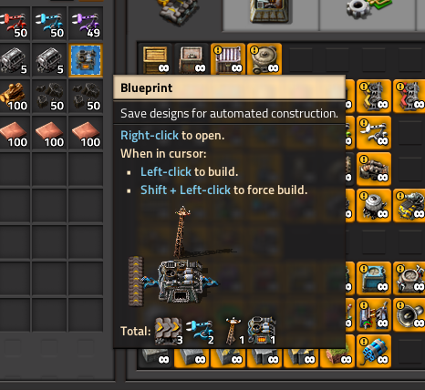

Quickstart
==========

Installation
------------

Like many Python modules, Draftsman is easy to install:

.. code-block:: console

    (.venv) $ pip install factorio-draftsman

From there you should be able to open an interpreter and check the version of Draftsman and the version of Factorio's data it ships with:

>>> import draftsman
>>> draftsman.__version__
'3.0.0'

If you see an output like above, then Draftsman should have installed correctly.

Creating a Blueprint
--------------------

In order to show off how to use Draftsman, let's create a blueprint to play around with:

.. image:: ../img/quickstart/starter_blueprint.png
    :alt: A small, but standard blueprint featuring a belt, some inserters, a power pole, and an electric furnace.
    :align: center

And here's it's blueprint string:

.. code-block::

    0eNqVkuFqhTAMhd8lv+tFvdZNX+UyRtXcEWijtHXsIn33Vbe5gQrzZ5qeLyeHTNDoEQdL7KGegNqeHdS3CRy9sdLzGyuDUANqbL2lNrmPllWLEAQQd/gBdRZeBCB78oRf6qV4vPJoGrTxg/ihGOxoNMkKG3qNIGDoXRT3PM+LwOeLFPCIuosMQWxw+YrzVrEbeuuTBrXfguQ36LoPup4G5fugYgXdlfMJsUPrY2PDKf8YEtCRjTks3SzfwUpxmP5hZgerlv91mKWnLD6djrCYDcaDIY8myn7vT8A7WrcIZJlXRVXJUqaZTIsQPgElXN/P

Factorio blueprint strings are simply base64 + zlib compressed JSON text files, which can be easily decoded into Python dictionaries and re-encoded after modification. 
Let's start off simple by doing just that:

.. doctest::

    >>> from draftsman import utils
    >>> bp_string = "0eNqVkuFqhTAMhd8lv+tFvdZNX+UyRtXcEWijtHXsIn33Vbe5gQrzZ5qeLyeHTNDoEQdL7KGegNqeHdS3CRy9sdLzGyuDUANqbL2lNrmPllWLEAQQd/gBdRZeBCB78oRf6qV4vPJoGrTxg/ihGOxoNMkKG3qNIGDoXRT3PM+LwOeLFPCIuosMQWxw+YrzVrEbeuuTBrXfguQ36LoPup4G5fugYgXdlfMJsUPrY2PDKf8YEtCRjTks3SzfwUpxmP5hZgerlv91mKWnLD6djrCYDcaDIY8myn7vT8A7WrcIZJlXRVXJUqaZTIsQPgElXN/P"
    
    # Convert the blueprint string to a Python dictionary
    >>> blueprint_dict = utils.string_to_JSON(bp_string)
    
    # Set or add the label (title) of the blueprint
    >>> blueprint_dict["blueprint"]["label"] = "Hello, Draftsman!"

    # Re-encode the modifications and print to user
    >>> print(utils.JSON_to_string(blueprint_dict))
    0eNqVktFOhDAQRX9F57lsFpai8LwP/oMxpsBgmrRT0hbjhvTfLahoAiTyOJ25Z25vZoRaDdhbSR6qEWRjyEH1PIKTbyTU9EZCI1SAChtvZZN0gyXRIAQGklr8gCoNLwyQvPQSv9RzcXulQddo4wD7oWhs5aCTBdYbhcCgNy6KDU37IvDxxBncou7EQ2ArXLbgvBXkemN9UqPyaxD/Bl22QZfDoGwblC+gTjifSHJofWysOMUfQwxaaWMOczfNNrCc7aa/m9nOV4v/OkzPhyw+HI4wnwzGg5EedZT93h+Dd7RuFvAiK/Oy5AU/p/wc01UiQuP0Eypl2N3Vis47LegeQvgEFgjovg==

When we import this string into Factorio, we get the same blueprint again but with it's name changed to "Hello, Draftsman!"

.. image:: ../img/quickstart/starter_name_altered.png
    :alt: The same blueprint, but with it's name altered.
    :align: center

For some users, these two functions `and this page <https://wiki.factorio.com/Blueprint_string_format>`_ are perfectly sufficient to complete their Factorio blueprint related project. 
Technically, that's *is* all you need; blueprint strings are just JSON dicts after all. 
However, Draftsman intends to be far more than just 4 lines of code!

Lets start by instead of loading the blueprint string into a raw dict, we load it into a :py:class:`.Blueprint` instance:

.. doctest::

    >>> from draftsman.blueprintable import Blueprint
    >>> bp_string = "0eNqVkuFqhTAMhd8lv+tFvdZNX+UyRtXcEWijtHXsIn33Vbe5gQrzZ5qeLyeHTNDoEQdL7KGegNqeHdS3CRy9sdLzGyuDUANqbL2lNrmPllWLEAQQd/gBdRZeBCB78oRf6qV4vPJoGrTxg/ihGOxoNMkKG3qNIGDoXRT3PM+LwOeLFPCIuosMQWxw+YrzVrEbeuuTBrXfguQ36LoPup4G5fugYgXdlfMJsUPrY2PDKf8YEtCRjTks3SzfwUpxmP5hZgerlv91mKWnLD6djrCYDcaDIY8myn7vT8A7WrcIZJlXRVXJUqaZTIsQPgElXN/P"
    
    # Create a Blueprint object
    >>> blueprint = Blueprint.from_string(bp_string)
    >>> blueprint.label = "Hello, Draftsman!"
    
    >>> print(blueprint)
    <Blueprint>{
      "item": "blueprint",
      "version": 562949956501504,
      "label": "Hello, Draftsman!",
      ...
    }
    >>> print(blueprint.to_string())
    0eNqV0N1qhDAQBeBXaec6LuoaW73uRd+hLCXqWAJJlGQsFcm7N9pFFlSol/k5X05mgkoN2FtpCMoJJKGG8mGPwTdaJzsDJc/TIisKnvM44XHGQIkKVbj9jkp17OnNipacFuY5pGTdGQflRyBNgz9QJgyc/DJCzc/Q2GMILq8xMELPK1RYk5V11A7WiBrB+xsDNCRJ4p+1LMZPM+gK7WLesxobOehoJfpOYZD7zoXwXH6C0OH1whmMIXfh3rMNl64cWWFc31mKwg9pC/E7dN2HrqehdB/KVqgVjiJpHFoKBxsnfyjEoJE2zGE5TdIdlh/P/HBmB1/N/9swiU9VfDk9wmwuePP+F5yl7R0=

``Blueprint`` allows the user to modify all components of the blueprint by attribute, as shown with :py:attr:`~.Blueprint.label` above. 
``Blueprint`` also provides methods that operate on itself, such as the :py:meth:`~.Blueprint.to_string` function, as well as a prettier string representation using the Python standard library ``json``.

Draftsman strives to be *"Factorio-safe"*, meaning that if the blueprint string raises an error on import, it should raise an error in script. 
This can be quickly demonstrated by attempting to set the label to anything other than a string:

.. doctest::

    >>> blueprint.label = False
    Traceback (most recent call last):
        ...
    draftsman.error.DataFormatError: 'label' must be an instance of str

Draftsman reserves the value ``None`` to represent either 'no-value' or 'default-value', in cases where you intentially want to omit certain attributes.
For example, even though ``label`` must be a string, we can set it to ``None``, which will default it back to an empty string:

.. doctest::

    >>> blueprint.label = None
    >>> assert blueprint.label == ""

In Factorio, a label consisting of an empty string is equivalent to no label at all, and it's label will be the game-given default of "Blueprint":

Adding Entities
---------------

Now let's say we want to add a steel chest to our blueprint to hold the output of the furnace. 
For this, draftsman gives you the :py:class:`.Entity` class (or, rather, base class). 
For simplicity's sake we'll ignore ``Blueprint`` for the moment and focus on just entities.

.. doctest::

    >>> from draftsman.entity import Container
    
    # Create a Container instance, which is a child of Entity.
    >>> container = Container("steel-chest")

:py:class:`.Container` is a type of ``Entity``, used for holding items and typically includes all the regular chests. 
The first positional argument to any entity is always it's name. 
It's name has to match the name of a valid Factorio name (`under the current environment <environment.rst>`_), otherwise it will raise an :py:class:`.UnknownEntityWarning`.
If Draftsman cannot recognize your entity, you can still create, import, modify, and export it; but Draftsman will be unable to provide useful metadata about it, or validate it entirely. 
You can query exactly what the valid names for containers are by checking :py:data:`draftsman.data.entities.containers`:

.. doctest::

    >>> from draftsman.data import entities
    >>> print(entities.containers)
    ['wooden-chest', 'red-chest', 'iron-chest', 'factorio-logo-11tiles', 'bottomless-chest', 'factorio-logo-16tiles', 'crash-site-chest-1', 'blue-chest', 'factorio-logo-22tiles', 'crash-site-chest-2', 'steel-chest']

Doing so gives you all valid entity names of that type; the example above is a likely output with a vanilla installation of Draftsman.

.. NOTE::
    :py:data:`.entities.containers` and all other "entity lists" include *hidden* items, as well as items that exist internally that are not craftable or otherwise available, such as (in the case of Container) the Factorio logo entities. 
    This is done for completeness sake, as it is hard to distinguish 'unwanted' entities, especially since 'unwanted' is contextual. 
    Keep this in mind before blindly iterating over these lists expecting only the visible entities.

Sometimes, for singleton entities it can be redundant to specify the name for an entity if it's going to be the same every time. 
Take :py:class:`.ProgrammableSpeaker` for example: in most cases, there is only going to be one entity of that type. 
As a result, all entities have a default name which is the first index of the entity list for that type:

.. doctest::

    >>> from draftsman.entity import ProgrammableSpeaker

    >>> speaker = ProgrammableSpeaker()
    >>> assert speaker.name == "programmable-speaker"
    >>> assert speaker.name == entities.programmable_speakers[0]

This feature also works for all other entities as well, not just singletons:
    
.. doctest::

    >>> from draftsman.entity import Container
    
    >>> container = Container()
    >>> assert container.name == "wooden-chest"

.. NOTE::

    The order of each entity list is determined by the `Factorio sort order <https://forums.factorio.com/viewtopic.php?p=23818#p23818>`_.
    Simply put, items are sorted first by their group, subgroup, and then item order strings. 
    If the entity has no item order string, it is sorted by entity order string, and, failing that, entity name.
    This is the order that you see when you look in the crafting menu in-game:

    .. image:: ../img/quickstart/crafting_menu.png
        :alt: A screenshot of Factorio's in-game crafting menu.
        :align: center

    You can see that because "wooden-chest" is to the left of "iron-chest", "wooden-chest" will always be before "iron-chest" in ``entities.containers`` (Unless some mod messes with their order strings!)
    
    Because the order is highly dependent on the environment the script is running in, it's not portable to rely on defaults to be any specific entity, so while it is an option for simple scripts, in general: "explicit is better than implicit."

Sometimes we might know what the name of an entity is, but not its internal type.
As a result, there exists the factory function :py:func:`.new_entity` for this exact situation:

.. doctest::

    >>> from draftsman.entity import new_entity, Container

    >>> any_entity = new_entity("steel-chest")
    >>> assert isinstance(any_entity, Container)

All entities need at least two things: their name, which we just covered, and a position.

For ease of use, Draftsman employs two commonly used coordinates that are updated in tandem: :py:attr:`~.Entity.position` and :py:attr:`~.Entity.tile_position`.
The ``position`` of an entity is in floating point coordinates and is the actual implementation of its position; it usually lies directly at the center of the entity, either sitting in the middle of the tile grid or on its transition.
The ``tile_position`` of an entity is a virtual attribute, specified in integer coordinates and lies at the position of the top-leftmost tile covered by the entity.

.. figure:: ../img/quickstart/tile_vs_absolute.png
    
    The red dots represent the ``position``, the green dots the ``tile_position``, and the green squares the associated tile at ``tile_position``.

If no position for the entity is specified, it defaults to ``tile_position`` (0, 0). Its absolute position is then deduced from its :py:attr:`~.Entity.tile_width` and :py:attr:`~.Entity.tile_height`:

.. doctest::

    >>> container = Container("steel-chest")
    >>> container.tile_position
    Vector(0, 0)
    >>> (container.tile_width, container.tile_height)
    (1, 1)
    >>> container.position
    Vector(0.5, 0.5)

As shown, both ``position`` and ``tile_position`` are instances of :py:class:`.Vector`, which is a standard 2D vector with an ``x`` and ``y`` attribute.
You can specify either parameter and the other will update to the proper value:

.. doctest::

    >>> from draftsman.utils import Vector
    >>> container = Container("steel-chest")
    >>> container.position = Vector(10.5, 10.5)
    >>> container.tile_position
    Vector(10, 10)

Because the explicit ``Vector`` constructor form is a little unweildly, you can also specify either position type as a sequence, usually a list or tuple:

.. testsetup:: group3

    from draftsman.entity import Container
    container = Container("steel-chest")

    from draftsman.blueprintable import Blueprint
    blueprint = Blueprint()

.. doctest::
    
    # Tuple
    >>> container.position = (15.5, 45.5)
    >>> container.position
    Vector(15.5, 45.5)
    
    # List
    >>> container.tile_position = [2, 3]
    >>> container.tile_position
    Vector(2, 3)

You can specify these parameters (in any of the above forms) in the constructor to immediately set the Entity's position as well:

.. doctest::

    >>> container1 = Container("steel-chest", tile_position = (-5, 10))
    >>> container2 = Container("iron-chest", position = [10.5, 15.5])

We want to position the container such that the output inserter feeds into it.
But what coordinate is that?
We have to figure out exactly where the rest of the entities are before we know where to put the steel chest.
We could grab a random entity in :py:attr:`.blueprint.entities` to get a rough idea, but let's do something a little more sophisticated instead:

.. doctest::

    >>> furnace = blueprint.find_entities_filtered(name = "electric-furnace")[0]
    >>> print(furnace) 
    <Furnace at 0x...>{'name': 'electric-furnace', 'position': {'x': 8.5, 'y': 3.5}}

Anyone familiar with the `LuaSurface API <https://lua-api.factorio.com/latest/LuaSurface.html#LuaSurface.find_entities_filtered>`_ might recognize this function.
This rendition searches the entities in the blueprint with a set of criteria and returns the list of entities that match.
Here, we search for any entity with the name ``"electric-furnace"``, which returns a list with a single reference to one of the entities in the blueprint. 
This will give us a nice anchor to read from as we know there is only one.

Since we now know that the center of the furnace is at (8.5, 3.5), we can simply set the container 3 tiles to the right to place it correctly. ``Vector`` s are smart, so we can add a tuple (or list or dict) to the furnace position and set the result to the container's position:

.. doctest::

    >>> container.position = furnace.position + (3, 0)

    # Now we can add it to the blueprint
    >>> blueprint.entities.append(container)
    Container(name='steel-chest', ...)

And presto!

.. image:: ../img/quickstart/final_blueprint.png
    :alt: The final created blueprint.
    :align: center

Specifying the blueprint in absolute coordinates can feel somewhat clunky though.
It might be slicker to move the entire blueprint from its absolute position to a normalized position, such as around the origin.
This would make the positions consistent, regardless of where the blueprint was originally constructed.
Lets use :py:meth:`.Blueprint.translate` to do just that:

.. testsetup:: alternative

    from draftsman.blueprintable import Blueprint
    from draftsman.entity import Container

    bp_string = "0eNqVkuFqhTAMhd8lv+tFvdZNX+UyRtXcEWijtHXsIn33Vbe5gQrzZ5qeLyeHTNDoEQdL7KGegNqeHdS3CRy9sdLzGyuDUANqbL2lNrmPllWLEAQQd/gBdRZeBCB78oRf6qV4vPJoGrTxg/ihGOxoNMkKG3qNIGDoXRT3PM+LwOeLFPCIuosMQWxw+YrzVrEbeuuTBrXfguQ36LoPup4G5fugYgXdlfMJsUPrY2PDKf8YEtCRjTks3SzfwUpxmP5hZgerlv91mKWnLD6djrCYDcaDIY8myn7vT8A7WrcIZJlXRVXJUqaZTIsQPgElXN/P"

    blueprint = Blueprint.from_string(bp_string)
    blueprint.label = "Hello, draftsman!"

    # Normalize coordinates to furnace center
    furnace = blueprint.find_entities_filtered(type = "furnace")[0]
    container = Container("steel-chest")

.. doctest:: alternative

    # Lets say we want to set the blueprint origin to the middle tile of the
    # 3x3 electric furnace
    # First, lets get the tile position of the furnace (which is it's top left 
    # corner) and add 1 to each coordinate to get its center tile
    >>> center = furnace.tile_position + (1, 1)
    
    # Now we translate in the opposite direction to make that point the origin
    >>> blueprint.translate(-center.x, -center.y)
    >>> print(furnace.tile_position)
    (-1, -1)

    # Now we can specify the container at tile position (3, 0) and get the same result as before.
    >>> container.tile_position = (3, 0)
    >>> blueprint.entities.append(container)
    Container(name='steel-chest', ...)
    
.. NOTE::

    Draftsman follows Factorio's coordinate system, in which positive X is right and positive Y is down.

Lets change one more of the Container's attributes to illustrate one more concept about Draftsman.
Suppose we want to set the limiting bar to limit half the inventory:

.. image:: ../img/quickstart/steel_chest_inventory.png
    :alt: A steel chest with it's bar covering half it's contents.
    :align: center

.. code-block:: python

    # We can set it using the bar attribute:
    container.bar = 24 # (48 / 2)

.. Note::
    
    All methods and attributes in Draftsman use **0-indexed notation.** 
    Factorio itself is not consistent between 0 and 1 indexing, but Draftsman is.

However, what if we didn't know that a steel-chest has 48 slots? 
Or what if steel-chest's inventory size was changed by some mod? 
Instead, we can write something like this:

.. code-block:: python

    container = Container("whatever-container-we-want")
    # Note: Container.size is read only
    container.bar = container.size / 2

which works with every Container (even modded ones!):

.. image:: ../img/quickstart/all_default_container_inventories.png
    :alt: A side-by-side of all 3 default chests with their inventories half restricted.
    :align: center

Being *"Factorio-safe"* applies to entities as well. 
Towards this goal, Draftsman will automatically try to coerce data to be in the correct form it expects whenever possible.
For example, because :py:attr:`~.Container.bar` must be an integer in order to import into Factorio, Draftsman will automatically try to convert a given float into an integer value for you:

.. doctest::

    >>> container.bar = 8.5
    >>> container.bar
    8

Similarly, if we were to set the bar to be anything outside of the value range of a ``uint16``, Factorio would refuse to import the entity. 
Thus, Draftsman raises an exception right when we make the mistake:

.. doctest::
    
    >>> container.bar = -1
    Traceback (most recent call last):
       ...
    draftsman.error.DataFormatError: -1 did not match any of:
        * -1 must be >= 0
        * -1 must be None

However, what if we were to set the index to a number within that range, but *greater* than the number of inventory slots? 
Factorio imports this just fine, simply acting as if the bar index was not set, but does so *silently*; which, if such a component is critical, can be hard to catch. 
Wouldn't it be better to be notified of such a mistake without necessarily affecting program function?

As a result, in addition to attempting to be *"Factorio-safe"*, Draftsman also has the capability to be *"Factorio-correct"*: If some component or attribute does not break the importing/exporting process, but either doesn't make sense or fails to achieve the desired effect, users can opt-into warnings for linting-like behavior:

.. testsetup:: group1

    from draftsman.entity import Container

    container = Container("steel-chest")

.. doctest:: group1

    >>> from draftsman.validators import set_mode
    >>> from draftsman.constants import ValidationMode

    >>> set_mode(ValidationMode.PEDANTIC)
    <draftsman.validators.set_mode.<locals>.ValidationContext object at 0x...>
    >>> container.bar = 100
    %%%: BarWarning: Bar index (100) exceeds the container's inventory size (48)
      container.bar = 100

Thus, we can now see our mistake and fix it. Draftsman's validation can be manipulated in the opposite direction, too: the level of built-in validation can be minimized or even disabled entirely:

.. doctest:: group1

    >>> # `set_mode` can also be used as a context:
    >>> with set_mode(ValidationMode.DISABLED):
    ...     # Validation will be disabled only inside of this scope
    ...     container.bar = -1
    >>> container.bar
    -1
    >>> container.to_dict()
    {'name': 'steel-chest', 'position': {'x': 0.5, 'y': 0.5}, 'bar': -1}

One final thing. Remember that aside above about unrecognized entities still being useful, but not providing any metadata?

.. doctest::

    >>> container = Container("unknown-container")
    %%%: UnknownEntityWarning: Unknown entity 'unknown-container'; did you mean 'tank'?
    ...
    >>> container.bar = -1 # Still errors
    Traceback (most recent call last):
       ...
    draftsman.error.DataFormatError: -1 did not match any of:
        * -1 must be >= 0
        * -1 must be None
    >>> # But we have no idea of the inventory's size:
    >>> assert container.size is None
    >>> container.bar = 100 # ... which means no warnings!

Draftsman knows that all entities must have a bar that can fit inside an unsigned short; but if it doesn't know anything about ``"unknown-container"``, it cannot assert whether or not a bar value of 100 lies inside or outside of it's inventory size.
Thus, if you want or need access to this contextual information, it is generally recommended to keep your :doc:`Draftsman environment <concepts/environment>` up to date with your scripts.

With all the components discussed, we can finally put all the pieces together.
Here's a full working example:

.. code-block:: python

    from draftsman.blueprintable import Blueprint
    from draftsman.entity import Container

    bp_string = "0eNqVkuFqhTAMhd8lv+tFvdZNX+UyRtXcEWijtHXsIn33Vbe5gQrzZ5qeLyeHTNDoEQdL7KGegNqeHdS3CRy9sdLzGyuDUANqbL2lNrmPllWLEAQQd/gBdRZeBCB78oRf6qV4vPJoGrTxg/ihGOxoNMkKG3qNIGDoXRT3PM+LwOeLFPCIuosMQWxw+YrzVrEbeuuTBrXfguQ36LoPup4G5fugYgXdlfMJsUPrY2PDKf8YEtCRjTks3SzfwUpxmP5hZgerlv91mKWnLD6djrCYDcaDIY8myn7vT8A7WrcIZJlXRVXJUqaZTIsQPgElXN/P"

    blueprint = Blueprint.from_string(bp_string)
    blueprint.label = "Hello, draftsman!"

    # Normalize coordinates to furnace center
    furnace = blueprint.find_entities_filtered(type = "furnace")[0]
    center = furnace.tile_position + (1, 1)
    blueprint.translate(-center.x, -center.y)

    # Create our new entity
    container = Container("steel-chest", tile_position = (3, 0))
    container.bar = container.inventory_size / 2
    
    blueprint.entities.append(container)

    print(blueprint.to_string())

And for completeness sake, here's a copy of the changed blueprint string:

.. code-block::

    0eNqd0mtOhDAQAOCr6PxuN7zZ5QTewRhTYNAmbSHtYCSEu1uQGDagIf7r8+vMdEYoVY+dlYagGEFWrXFQPI/g5JsRal6joUMoQBJqYGCEnmeosCIrK9701ogKYWIgTY2fUITTCwM0JEnit7XeISuM61pLvERF3upa5w+1Zn7FX+TRJWUw+EFwSafVGF5Nr0u0s8vGX5/fYcFqHVLRhtJYy17zH7Fr1R8cD4+8eOOdzvIwsuQ/0mFM6UZqhCMujUNLfmsPhXch1dL6Wizb2Y7NzrPReTXfqI4QFa/e0R3kHN+ZpZg/M9lx17kFl4YtNv3N4AOtW6zoGib5LcrTMA3jLGCghK+xP/2ESrXsobaiIaeFeYRp+gIZ6waG

Hopefully now you can start to see just how convenient Draftsman is for manipulating blueprint strings. 
Still, this barely scratches the surface of this module's capabilities. 
If you want to know more about how Draftsman works and how you can use it to it's fullest, check out the :doc:`concepts <concepts/index>`.

If you want to take a look at some more complex examples, you can take a look at the `examples folder here <https://github.com/redruin1/factorio-draftsman/tree/main/examples>`_.

Alternatively, if you think you've seen enough and want to dive into the API, take a look at the :doc:`Reference <reference/index>`.