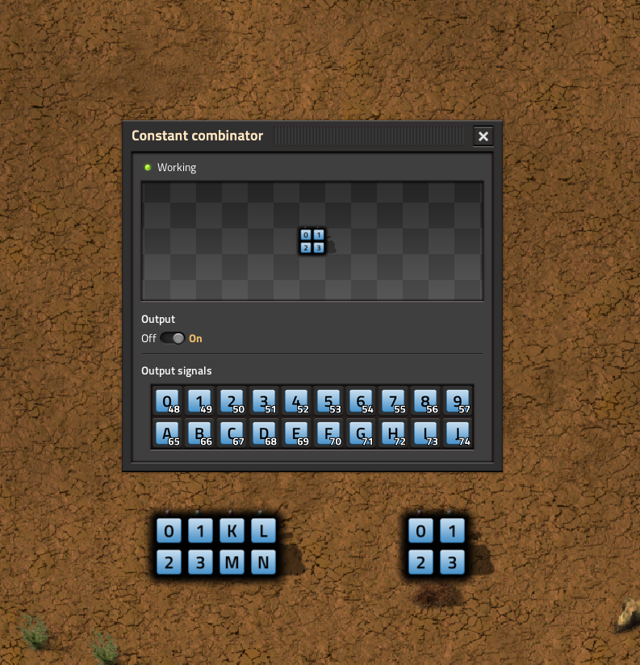
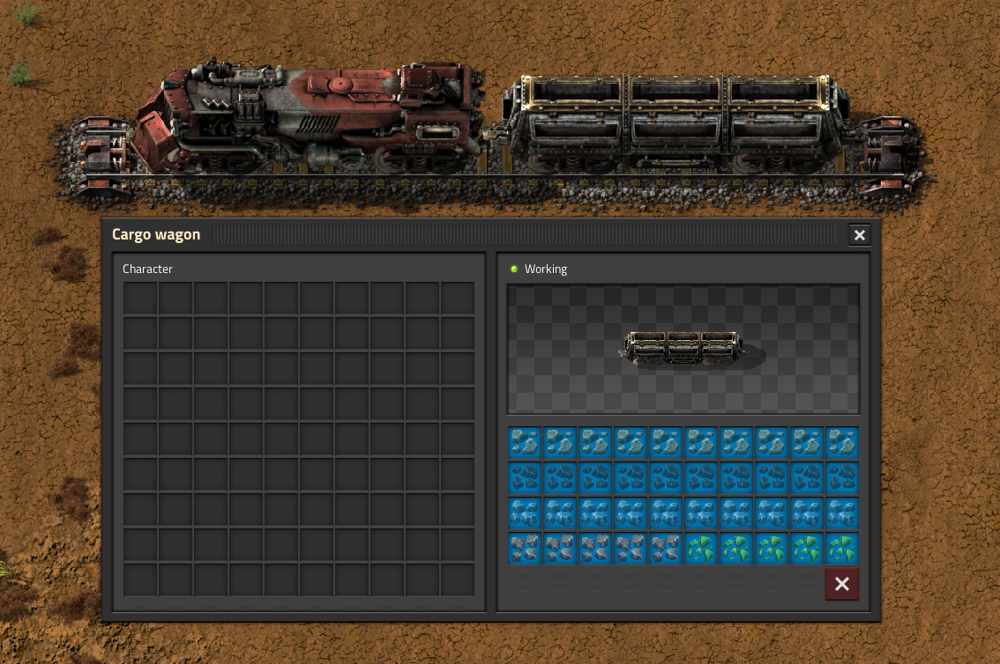
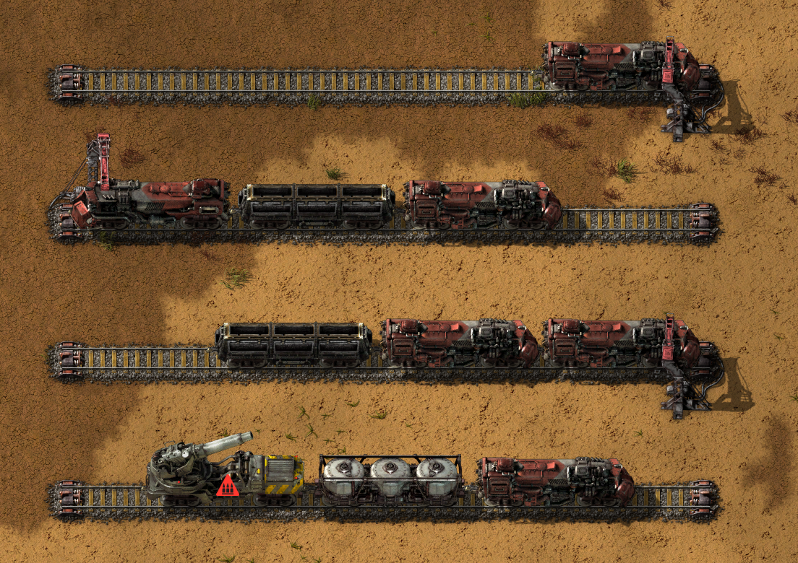
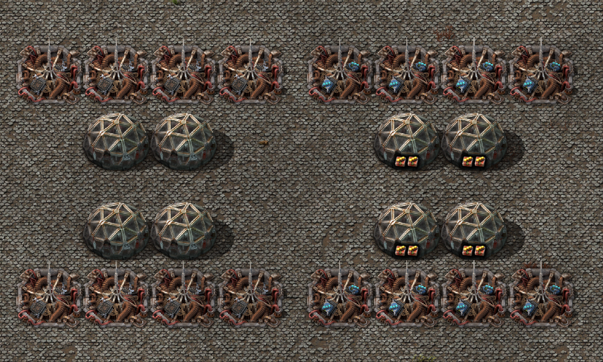
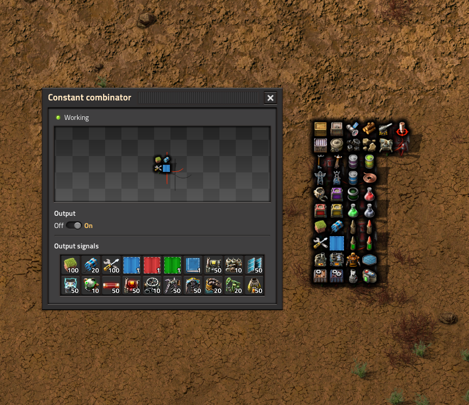
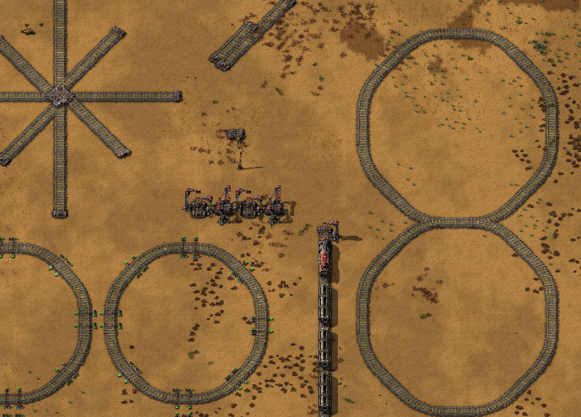
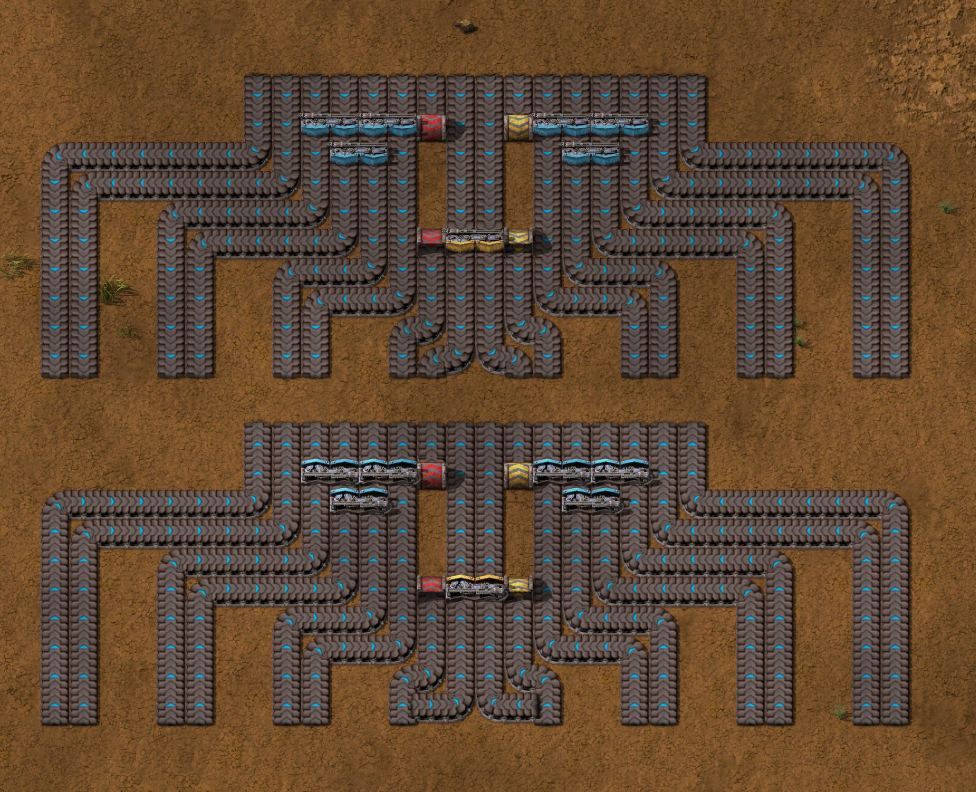
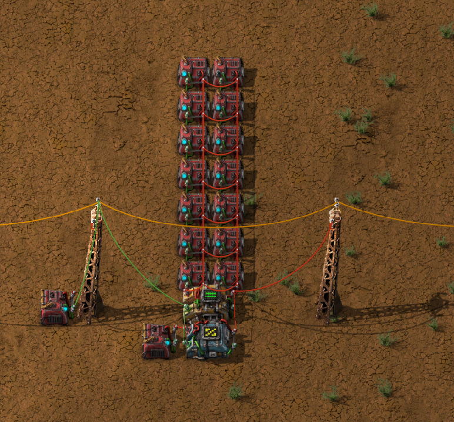
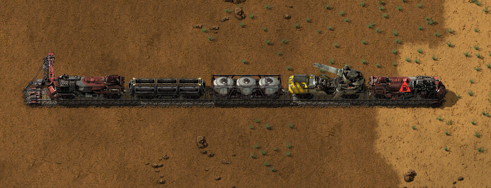
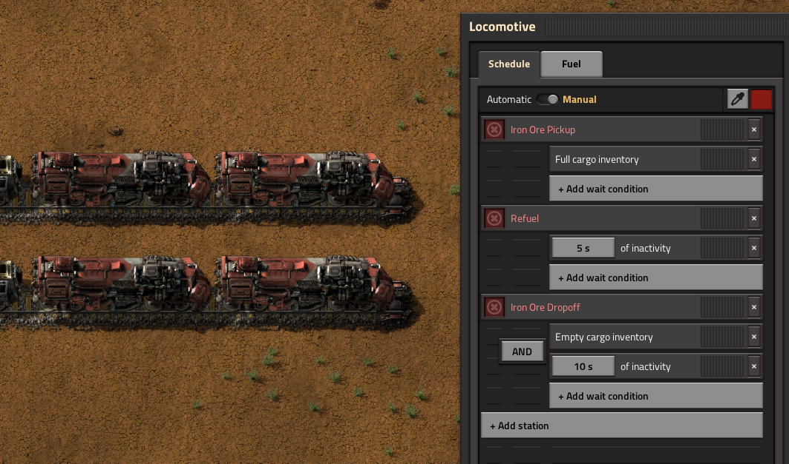

# Examples

## Sub-Folders
### [examples/entities](entities/)
* Entity specific programs, usually for ones with complex behaviors.

## [`blueprint_operands.py`](blueprint_operands.py)

Illustrates set operations (union, intersection, difference) with a blueprint's `EntityList`. Allows you to cleanly add or subtract one blueprint's entities or tiles to or from another without having to do the manual iteration yourself.

## [`combinator_ascii.py`](combinator_ascii.py)

Creates two constant combinator arrays; one which associates alphanumeric signals with their ASCII value, and another which produces a set of ordered signals where each value corresponds to a letter in the first combinator array. With some circuitry, one could convert a compact set of arbitrary signals with ASCII values to a set of alphanumeric signals, intended to be fed to a nixie-tube array to display text. Also supports nixie-tube symbol signals (`"[]{}()!.?@*-%+/"`) if the mod is detected and initialized.

## [`draftsman_logo.py`](draftsman_logo.py)

Creates a image of the Draftsman logo out of various place-able tiles. Requires that `pillow` and `numpy` are installed as well.

## [`filtered_train.py`](filtered_train.py)

Creates a train with specified filter slots; useful if you want to dynamically create outpost/resupply/trash trains. Adds as many wagons as needed to set the desired number of filter slots; any remaining space will remain unset. Also shows custom label and label color.

## [`find_trains_filtered.py`](find_trains_filtered.py)

Showcases how to use (most of) the parameters available when filtering a blueprint for it's trains. Trains can be searched by their composition, schedule, type, name, or even whether they're (positioned) behind a train stop.

*NOTE: the function `find_trains_filtered()` is rather new and may contain some false positives or other bugs.* Report them if you find any!

## [`image_converter.py`](image_converter.py)

Converts an arbitrary input image and converts it into a blueprint of place-able entities and tiles. Entities and tiles are chosen based on their (vanilla) map view color. Requires `pillow`, `numpy`, and optionally `pyperclip` if you want to copy the result directly to the clipboard.

## [`item_requester.py`](item_requester.py)

Command line tool that takes an input blueprint string, a entity name, a requested item to deliver to that entity, and the total integer amount to deliver to each. For example, you could take a blueprint full of empty trains and request 3 nuclear fuel to each locomotive, or to request modules of a certain type to every assembling machine in a production block. Note however that this is item requests, not logistics requests, so any item can be delivered to any entity (though it's not guaranteed that the delivery will be completed).

The tool only allows you to specify one item and amount at a time, but it can be run multiple times consecutively. Items can be removed from machines by setting their integer amount to zero.

## [`item_stack_signals.py`](item_stack_signals.py)

Generates a matrix of constant combinators where the value of each signal is that item's stack size. Obsolete as of Factorio 2.0 with the new selector combinator, but retained for instructional purposes.

## [`ltn_train_stop.py`](ltn_train_stop.py)

Showcases how `Entity` can be inherited to add additional functionality on top of existing classes, which can be useful particularly when working with modded entities. Adds both the
input and output entities associated with the train stop when added to a blueprint, and aliases them as `ltn_stop.input` and `ltn_stop.output`, meaning you can add wire connections to them very easily. By making the custom class, the boilerplate of ensuring the other entities are in the right position and orientation is abstracted away, making life much simpler. This pattern can be applied to all sorts of modded entities, as desired.

## [`pumpjack_placer.py`](pumpjack_placer.py)

Creates a massive blueprint of overlapping pumpjacks, so you can quickly place it on top of an oil field without having to manually place each individual one.

## [`rail_planner_usage.py`](rail_planner_usage.py)

Shows off how to use the `RailPlanner` class, which is not to dissimilar from placing rails in game. The class has a head and a direction, and can move forward or backward and turn left or right. Train signals and stops can be placed alongside as well with their corresponding functions. The script returns a `BlueprintBook` with a number of blueprints that illustrate the uses of a rail planner, as well as some things to be mindful of when dealing with rails in Factorio.

## [`reverse_belts.py`](reverse_belts.py)

Dynamic tool. Input a `Blueprint` or `BlueprintBook` string with belts, and a version with all the belts reversed is printed out. Sophisticated, so it handles curves as well as splitters and undergrounds without breaking continuity (unless the blueprint contains sideloaded belts).

## [`signal_index.py`](signal_index.py)

Creates a blueprint with a constant combinator matrix of all initialized signals, where each one a has unique non-zero value. The blueprint also contains a circuit for passing in a reserved signal on the left (`red-wire` by default) and outputting the matching unique signal with a value of 1 on the right. By taking this unit signal and multiplying it by the desired data value, this can be used (with some additional circuitry) to store up to 256+ unique values on a single memory-cell wire, which is great for storage space.

In the script, a number of signals can (and are) reserved, which is useful if you're designing circuits for which certain signals are prohibited. These signals can be customized and more added, though it will reduce the total amount of available signals in the combinator array. This script will also adjust to the currently loaded mod configuration, so every available signal will be indexed by default.

## [`train_configuration_usage.py`](train_configuration_usate.py)

Showcases how to use the `TrainConfiguration` class, which allows you to specify train layouts in an expanded version of the community-accepted "loco-wagons-loco" format. Each train configuration can then be customized (filters set, fuel requested, etc.) and then copied once or more into a `Blueprint` at a position or behind a station with or without a schedule.

Also outputs an additional blueprint string if it detects the Factorio-Extended Rail mod, which adds a bunch of upgraded train cars. This other blueprint showcases how you can customize an individual `TrainConfiguration` to use modded cars, or even use modded cars by default for all `TrainConfiguration` instances.

## [`train_schedule_usage.py`](train_schedule_usage.py)

Showcases how to construct train `Schedule` objects, how to properly use the `WaitCondition` and `WaitConditions` classes to create stops in those schedules, and how to assign that newly created schedule to new or existing trains within a blueprint.